<style>

.remark-slide-content {
  background-color: #FFFFFF;
  border-top: 80px solid #7C2529;
  font-size: 20px;
  font-weight: 300;
  line-height: 1.5;
  padding: 1em 2em 1em 2em
}

.inverse {
  background-color: #6E6259;
  border-top: 80px solid #6E6259;
  text-shadow: none;
}

.inverse-sub {
  background-color: #707372;
  border-top: 80px solid #707372;
  text-shadow: none;
}
.inverse-sub h1, .inverse-sub h2, .inverse-sub h3 {
  color: #f3f3f3;
}

.remark-slide-content > h1 {
  font-family: 'Songti SC';
  font-weight: normal;
  font-size: 45px;
  margin-top: -95px;
  margin-left: -00px;
  color: #FFFFFF;
}

.title-slide {
  background-color: #FFFFFF;
  border-top: 80px solid #7C2529;
  border-bottom: 20px solid #6E6259;
}

.title-slide > h1  {
  color: #1A292C;
  font-size: 40px;
  text-shadow: none;
  font-weight: 400;
  text-align: left;
  margin-left: 15px;
  padding-top: 80px;
}

body {
  font-family: 'Songti SC';
}

.remark-slide-number {
  font-size: 13pt;
  font-family: 'Songti SC';
  color: #272822;
  opacity: 1;
}

.inverse .remark-slide-number {
  font-size: 13pt;
  font-family: 'Songti SC';
  color: #FAFAFA;
  opacity: 1;
}

.inverse-sub .remark-slide-number {
  font-size: 13pt;
  font-family: 'Songti SC';
  color: #FAFAFA;
  opacity: 1;
}

a, a > code {
  color: #000000; /*default: rgb(249, 38, 114); || sets color of links */
  text-decoration: none; /* turns off background coloring of links */
}

.left-desc {
  width: 40%;
  height: 92%;
  float: left;
}
.right-plot {
  width: 59%;
  float: right;
  padding-left: 1%;
}

.tiny{font-size: 30%}
.small{font-size: 50%}
.medium{font-size: 75%}
.red{color: #9A3324}
.blue{color: #006BA6}
.tan{color: #9B945F}
.grey{color: #707372}
</style>

```{r echo = FALSE, message = FALSE, warning = FALSE}
# Packages
library(cowplot)
library(dplyr)
library(forcats)
library(ggforce)
library(ggplot2)
library(glmnet)
library(gower)
library(gretchenalbrecht)
library(knitr)
library(latex2exp)
library(lime)
library(limeaid)
library(purrr)
library(randomForest)
library(RefManageR)
library(tidyr)

# R markdown options
opts_chunk$set(echo = FALSE, dpi = 200, cache = FALSE)

# Biboptions
BibOptions(check.entries = FALSE,
           bib.style = "authoryear",
           cite.style = "authoryear",
           style = "markdown",
           hyperlink = FALSE,
           dashed = FALSE)
bib <- ReadBib("references.bib", check = FALSE)

# Plot theme
gg_procedure <- list(theme_bw(base_family = "Times", base_size = 14),
                     theme(aspect.ratio = 1)) 
```

# Personal Background

.pull-left[
**Education**

B.A. in Mathematics
  - Lawrence University (Appleton, WI)
  - Graduated in June 2013
  
M.S. in Statistics 
  - University of Wisconsin, Madison
  - Graduated in May 2015
  
Ph.D. in Statistics (in progress)
  - Iowa State University
  - Started in January 2016
  - Passed written prelim in 2017
]

.pull-right[

**Teaching**

- Teaching assistant at UW Madison
- Lecturer at Lawrence University
- Lecturer at ISU

**Consulting**

- AES Statistical Consultant
- NREM Research Assistant
  
**Internship**

- Sandia National Labs: Statistical Sciences Research and Development Intern
  
]

---

# Overview of Talk

1. Background and Overview of Thesis

2. Detailed explanation of Chapter 1
  - Visual Diagnostics of a Model Explainer -- Tools for the Assessment of LIME Explanations

3. Plan for Chapter 2
  - Explaining Random Forests using Clustering of Trees

4. Ideas for Chapter 3
  - Extensions of Neural Network Explanation Tools to Functional Data

5. Timeline and Discussion Points

---

class: middle, center, inverse

# Background and Overview of Thesis

---

# Explainable Machine Learning

- **Machine learning models**
  - Good in prediction problems
  - Many considered "black-boxes" since too complex to directly interpret

- Led to **explainable machine learning** research

  - **Goal**: explain predictions made by black-box models
  - Method overview papers/books: .medium[`r Citep(bib, c("gilpin:2018", "guidotti:2018", "ming:2017", "mohseni:2018", "molnar:2019", "samek:2019"))`].

- European General Data Protection Regulation (GDPR) implemented in 2018 includes a "right to explanation"

  > `r Citet(bib, "goodman:2016")`: "It is reasonable to suppose that any adequate explanation would, at a minimum, provide an account of how input features relate to predictions, allowing one to answer questions such as: Is the model more or less likely to recommend a loan if the applicant is a minority?"

---

# Explainability versus Interpretability

No accepted definitions for explainability and interpretability 
  - .medium[`r Citet(bib, c("gilpin:2018", "lipton:2016", "molnar:2019", "montavon:2017", "murdoch:2019"))`]  

My definitions (implicitly used by `r Citet(bib, "rudin:2018")` and `r Citet(bib, "ribeiro:2016")`):

.pull-left[
**Interpretability** is the ability to .blue[directly use model parameters] to understand the .red[mechanism of how the model makes predictions].

- Linear regression model
$$\hat{y}=\hat{\beta}_0+\hat{\beta}_1x_1+\cdots+\hat{\beta}_px_p$$
]

.pull-right[
**Explainability** is the ability to .blue[use the model in an indirect manner] to understand the .red[relationships in the data captured by the model].

- LIME: local interpretable model-agnostic explanations `r Citep(bib, "ribeiro:2016")`

```{r out.width = "50%", fig.align = "center"}
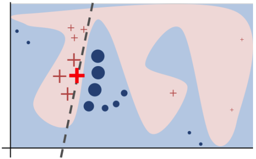
```

]

---

# Model Agnostic Methods

.pull-left[
**General Model Visualizations**: .red[Strategies for understanding any model]

.medium[
- Removing the blindfold .small[`r Citep(bib, "wickham:2015")`]
]

**Global Methods**: .red[Explanation for model as a whole]

.medium[
- Partial dependence plots .small[`r Citep(bib, "friedman:2001")`] and extensions:
  - Interactive partial dependence plots .small[`r Citep(bib, "krause:2016")`]
  - Individual conditional expectation plots .small[`r Citep(bib, "goldstein:2013")`]
  - Accumulated local effect plots .small[`r Citep(bib, "apley:2016")`]
  - Feature interaction plots .small[`r Citep(bib, c("friedman:2008", "greenwell:2018", "hooker:2004"))`]
- Global feature importance plots .small[`r Citep(bib, c("fisher:2018", "altmann:2010", "casalicchio:2019"))`]
- Global surrogate models .small[`r Citep(bib, "molnar:2019")`]
]

]

.pull-right[
```{r out.width = "100%", fig.align = "center", fig.cap = "Model in data-space from Wickham, Cook, and Hofmann (2015)."}
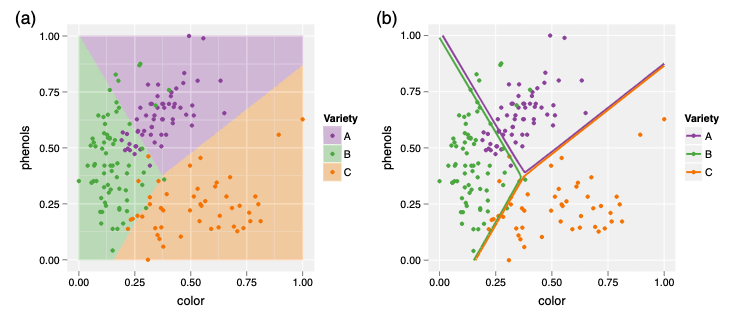
```

```{r out.width = "75%", fig.align = "center", fig.cap = "Partial dependence plot from Molnar (2019)."}
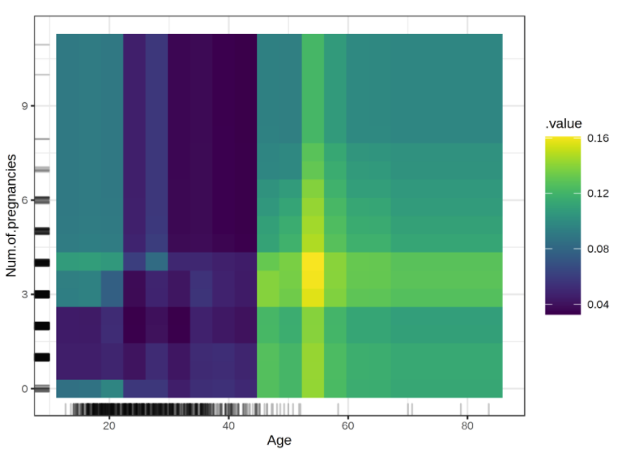
```
]

---

# Model Agnostic Methods

.pull-left[
**Local Methods**: .red[Explanation for an individual prediction]

.medium[
- Individual conditional importance plots .small[`r Citep(bib, "casalicchio:2019")`]
- LIME .small[`r Citep(bib, "ribeiro:2016")`]
- Anchors (scoped rules) .small[`r Citep(bib, "ribeiro:2018")`]
- Shapely values .small[`r Citep(bib, "štrumbelj:2014")`]
- SHAP .small[`r Citep(bib, "lundberg:2017")`]
- breakDown .small[`r Citep(bib, "staniak:2018")`]
]

**Example Based**: .red[Explanations based on examples from the data]

.medium[
- Counterfactual examples .small[`r Citep(bib, c("wachter:2017", "martens:2014", "looveren:2019", "laugel:2017"))`]
- Adversarial examples .small[`r Citep(bib, c("szegedy:2013", "goodfellow:2014", "biggio:2018", "su:2019"))`]
- Prototypes and criticisms .small[`r Citep(bib, "kim:1016")`]
- Influential instances .small[`r Citep(bib, "koh:2017")`]
]
]

.pull-right[
```{r out.width = "75%", fig.align = "center", fig.cap = "Bar chart of shapley values from Molnar (2019)."}
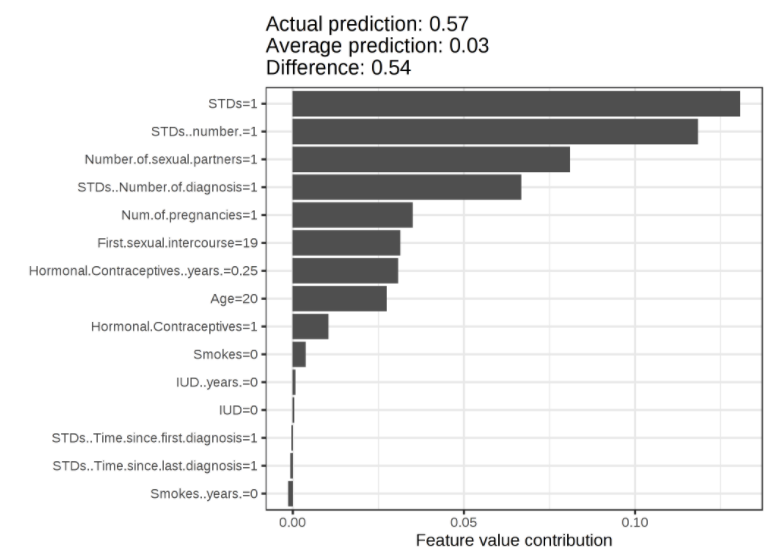
```

```{r out.width = "65%", fig.align = "center", fig.cap = "Adversarial example where one pixel change affects prediction from Su (2019)."}
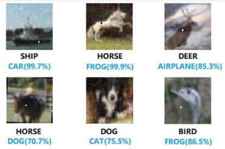
```
]
---

# Model Specific Methods

.pull-left[
**Random Forests**

.medium[
- Random forest impurity based feature importance .small[`r Citep(bib, "breiman:2001")`]
- Sectioned scatterplots .small[`r Citep(bib, "urbanek:2008")`]
- Trace plots of trees .small[`r Citep(bib, "urbanek:2008")`]
- Simplified model .small[`r Citep(bib, "hara:2016")`]
- Forest floor visualizations .small[`r Citep(bib, "welling:2016")`]
- Interactive visualizations .small[`r Citep(bib, c("beckett:2018", "dasilva:2017"))`]
]

**Neural Networks**

.medium[
- Extracting tree structures .small[`r Citep(bib, "craven:1996")`]
- Saliency maps .small[`r Citep(bib, "simonyan:2013")`]
- Feature visualization .small[`r Citep(bib, "olah:2017")`]
- Grand tours .small[`r Citep(bib, "li:2020")`]
- Flows .small[`r Citep(bib, "halnaut:2020")`]
]
]

.pull-right[
```{r out.width = "60%", fig.align = "center", fig.cap = "Sectioned scatterplot from Urbanek (2008)."}
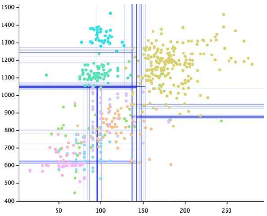
```

```{r out.width = "60%", fig.align = "center", fig.cap = "Saliency maps from Simonyan, Vedaldi, and Zisserman (2013)."}
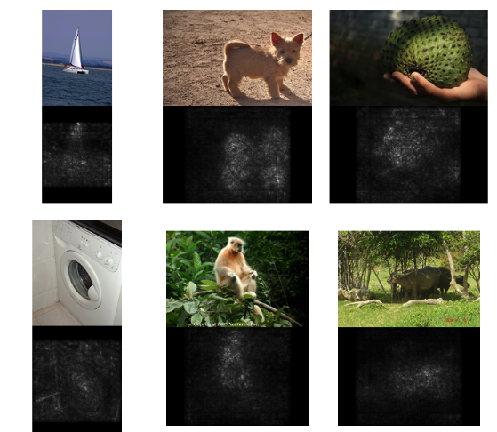
```
]

---

# .medium[Assessments of Explainable Machine Learning]

.pull-left[
**General**

.red[Argument against black box model explanations] `r Citep(bib, "rudin:2018")`:
  - "Explanations must be wrong."
  - Explanations may not:
      - be faithful to the original model
      - make sense
      - be detailed enough to understand the "black-box" model
  - Debunks accuracy and interpretability trade-off myth
  - Use interpretable models for high-stakes decisions
]

.pull-right[
**Method Specific**

.red[Assessment of LIME] `r Citep(bib, "laugel:2018")`:
  - How to choose a local region?
  
.red[Assessment of counterfactual examples] `r Citep(bib, "laugel:2018")`:
  - Issues with unjustified counterfactual examples

.red[Assessment of saliency maps] `r Citep(bib, "kindermans:2017")`:
  - Transformation to input data affects saliency map but not model
]

---

# Overview of Dissertation Chapters

**Chapter 1: Visual Diagnostics for LIME**

- Discuss importance of assessing LIME
- Suggest the use of visualizations for assessment and provide example visualizations

<br>

**Chapter 2: Visualizations for Explaining Random Forests**

- Use clustering to identify key tree structures within the random forest
- Improve visualizations for use of trees as global surrogate models

<br>

**Chapter 3: Visualizations for Explaining Neural Networks**

- Project for my internship with Sandia National Labs
- Application with functional data
- Visualizations for the explaining and understanding the models

---

class: middle, center, inverse

# Chapter 1

## .center[Visual Diagnostics of a Model Explainer -- Tools for the Assessment of LIME Explanations]

---

# Motivation

.pull-left[
`r Citet(bib, "hare:2016")`:
- Want to provide quantitative evidence for whether two bullets were fired from the same gun
- Use high definition scans of striations on bullet lands to extract "signatures" 
- Compute similarity features to compare two signatures
]

.pull-right[
```{r out.width = "50%"}
include_graphics("figures/gun.png")
include_graphics("figures/bullet.png")
```
]

```{r out.width = "50%"}
include_graphics("figures/striae.png")
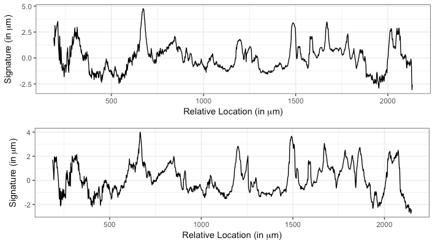
```

---
 
# Motivation

`r Citet(bib, "hare:2016")` approach: 
  - Random forest model
  - 9 signature similarity features
  - Returns a score for the comparison of two lands

```{r out.width = "100%", fig.align = "center"}
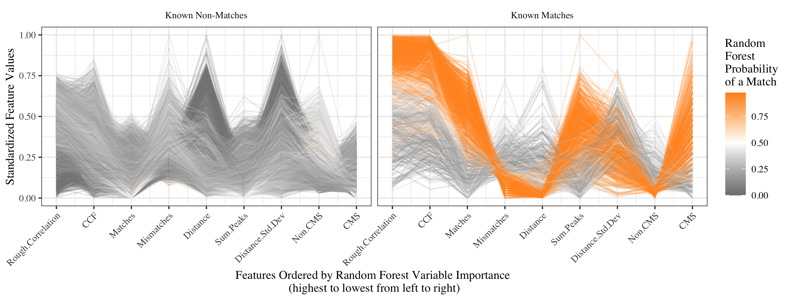
```

---

# Motivation

**Our Original Goal**: Provide explanations for specific signatures comparisons

**Attempt**: Applied LIME

**Result**: Unreasonable explanations (e.g., LIME explanation does not agree with random forest prediction)

**Example**: Known non-match

```{r fig.width = 7, fig.height = 5, out.width = "60%", message = FALSE, fig.align = "center"}
# Load the hamby data
bullet_train <- read.csv("../lime/data/hamby173and252_train.csv")
bullet_test <- read.csv("../lime/data/hamby224_test.csv")

# Extract the features and order them based on feature importance
bullet_features <- rownames(bulletxtrctr::rtrees$importance)
bullet_features_ordered <-
  data.frame(feature = rownames(bulletxtrctr::rtrees$importance),
             MeanDecreaseGini = bulletxtrctr::rtrees$importance) %>%
  arrange(desc(MeanDecreaseGini)) %>%
  mutate(feature = fct_recode(feature,
                              "CCF" = "ccf",
                              "CMS" = "cms",
                              "Matches" = "matches",
                              "Mismatches" = "mismatches",
                              "Non-CMS" = "non_cms",
                              "Rough Correlation" = "rough_cor",
                              "Distance Std Dev" = "sd_D",
                              "Distance" = "D",
                              "Sum Peaks" = "sum_peaks"))
bullet_features_ordered <- bullet_features_ordered %>%
  mutate(feature = factor(feature, levels = bullet_features_ordered$feature))

# Load the files
bullet_explain_noperms <- readRDS("../lime/data/hamby_explain.rds")

# Specify two cases of interest
bullet_poi_match <- unique(bullet_explain_noperms$case)[c(325)]
bullet_poi_nonmatch <- unique(bullet_explain_noperms$case)[c(20)]

# Apply LIME to two cases with the permutations returned
bullet_lime_explain_perms <- apply_lime(
  train = bullet_train %>% select(all_of(bullet_features)),
  test = bullet_test %>%
    filter(case %in% bullet_poi_match) %>%
    bind_rows(bullet_test %>%
    filter(case %in% bullet_poi_nonmatch)) %>%
    select(all_of(bullet_features)),
  model = bulletxtrctr::rtrees,
  label = as.character(TRUE),
  n_features = 3,
  sim_method = c('quantile_bins', 'equal_bins', 'kernel_density', 'normal_approx'),
  nbins = 3,
  feature_select = "auto",
  dist_fun = "gower",
  kernel_width = NULL,
  gower_pow = 0.5,
  return_perms = TRUE,
  all_fs = FALSE,
  seed = 20190914)

# Separate the lime and explain parts of the results
bullet_lime_perms <- bullet_lime_explain_perms$lime
bullet_explain_perms <- bullet_lime_explain_perms$explain %>%
  mutate(case = ifelse(case == 1,
                       bullet_poi_match,
                       bullet_poi_nonmatch))

# Determine the implementation and case number of the poi
# in the no_perms data
poi_cases_no_perms <- bullet_explain_noperms %>%
  filter(case %in% c(bullet_poi_match, bullet_poi_nonmatch),
         nbins %in% c(3, NA),
         gower_pow == 0.5) %>%
  select(case, implementation) %>%
  unique()

# Join the no perms data (with poi removed) with the
# perms data (perms removed)
bullet_explain <- bullet_explain_noperms %>%
  anti_join(poi_cases_no_perms,
            by = c("implementation", "case")) %>%
  bind_rows(bullet_explain_perms %>%
              select(-perms_raw, -perms_numerified,
                     -perms_pred_simple, -perms_pred_complex,
                     -weights))

bullet_explain %>%
  filter(sim_method == "quantile_bins",
         gower_pow == 1,
         case == bullet_poi_nonmatch,
         nbins == 3) %>%
  mutate(case = "20, 3 quantile bins)") %>%
  plot_features() +
  scale_fill_manual(values = c("darkorange", "grey50"))
```

---

# Conceptual Depiction of LIME

.pull-left[LIME `r Citep(bib, "ribeiro:2016")`:

- .tan[**L**ocal]
- .blue[**I**nterpretable]
- .grey[**M**odel-agnostic]
- .red[**E**xplanation]
]

.pull-right[
**Concept**: For *one prediction of interest*
- .tan[Focus on a neighborhood around the prediction of interest]
- .blue[Use an inherently interpretable model]
- .grey[Understand the complex model] 
- .red[Capture the relationship between the complex model predictions and predictor variables]
]

```{r}
# Simulate example data
set.seed(20190624)
lime_data <-
  data.frame(
    feature1 = sort(runif(250, 0, 1)),
    feature2 = sample(x = 1:250, size = 250, replace = FALSE)) %>%
  mutate(
    feature1_stnd = (feature1 - mean(feature1)) / sd(feature1),
    feature2_stnd = (feature2 - mean(feature2)) / sd(feature2),
    prediction = if_else(feature1 >= 0 & feature1 < 0.1,
                         (0.3 * feature1) + rnorm(n(), 0, 0.01),
                 if_else(feature1 >= 0.1 & feature1 < 0.3,
                         rbeta(n(), 1, 0.5),
                 if_else(feature1 >= 0.3 & feature1 < 0.5,
                         sin(pi* feature1) + rnorm(n(), 0, 0.5),
                 if_else(feature1 >= 0.5 & feature1 < 0.8,
                         -(sin(pi* feature1) + rnorm(n(), 0, 0.1)) + 1,
                 if_else(feature1 >= 0.8 & feature1 < 0.9,
                         0.5 + runif(n(), -0.5, 0.5),
                         0.5 + rnorm(n(), 0, 0.3))))))) %>%
  bind_rows(
    data.frame(feature1 = rep(1, 30) + rnorm(5, 0, 0.05),
           feature2 = rep(245, 30) + rnorm(5, 0, 1),
           prediction = rep(0, 30) + rnorm(5, 0, 0.05)) %>%
  mutate(feature1_stnd = (feature1 - mean(feature1)) / sd(feature1),
         feature2_stnd = (feature2 - mean(feature2)) / sd(feature2)))

# Specify a prediction of interest
prediction_of_interest <-
  data.frame(feature1 = 0.07, feature2 = 200) %>%
  mutate(feature1_stnd = (feature1 - mean(lime_data$feature1)) /
           sd(lime_data$feature1),
         feature2_stnd = (feature2 - mean(lime_data$feature2)) /
           sd(lime_data$feature2),
         prediction = 0.05,
         color = factor("Prediction \nof Interest"))

# Specify the gower exponents
good_gower_power <- 50
bad_gower_power <- 1

# Compute the good distances between the prediction of interest
# and all other observations
lime_data$distance_good <-
  (1 - gower_dist(x = prediction_of_interest %>%
                    select(feature1_stnd, feature2_stnd),
                  y = lime_data %>%
                    select(feature1_stnd,
                           feature2_stnd)))^good_gower_power

# Compute the bad distances between the prediction of interest
# and all other observations
lime_data$distance_bad <-
  (1 - gower_dist(x = prediction_of_interest %>%
                    select(feature1_stnd, feature2_stnd),
                  y = lime_data %>%
                    select(feature1_stnd,
                           feature2_stnd)))^bad_gower_power

# Prepare the data for plotting
lime_data_gathered <- lime_data %>%
  gather(feature, feature_stnd_value,
         feature1_stnd:feature2_stnd) %>%
  gather(distance, distance_value, distance_good:distance_bad) %>%
  mutate(distance = fct_recode(distance,
                               "good" = "distance_good",
                               "bad" = "distance_bad"),
         feature = fct_recode(feature,
                              "Feature 1" = "feature1_stnd",
                              "Feature 2" = "feature2_stnd"))

# Prepare the prediction of interest data for plotting
prediction_of_interest_gathered <- prediction_of_interest %>%
  select(-feature1, -feature2) %>%
  gather(feature, feature_value, feature1_stnd, feature2_stnd) %>%
  mutate(feature = fct_recode(feature,
                              "Feature 1" = "feature1_stnd",
                              "Feature 2" = "feature2_stnd"))

# Fit the good interpretable explainer model
explainer_good <-
  glmnet(x = lime_data %>% select(feature1_stnd, feature2_stnd)
         %>% as.matrix(),
         y = lime_data$prediction,
         alpha = 0,
         lambda = 1,
         weights = lime_data$distance_good)

# Fit the bad interpretable explainer model
explainer_bad <-
  glmnet(x = lime_data %>% select(feature1_stnd, feature2_stnd)
         %>% as.matrix(),
         y = lime_data$prediction,
         alpha = 0,
         lambda = 1,
         weights = lime_data$distance_bad)

# Join the coefficients from the explainer model into a dataframe
coefs_data <- data.frame(case = c("good", "bad"),
                         b0 = c(coef(explainer_good)[1],
                                coef(explainer_bad)[1]),
                         b1 = c(coef(explainer_good)[2],
                                coef(explainer_bad)[2]),
                         b2 = c(coef(explainer_good)[3],
                                coef(explainer_bad)[3])) %>%
  mutate(feature1 = b0 + b2*prediction_of_interest$feature2_stnd,
         feature2 = b0 + b1*prediction_of_interest$feature1_stnd) %>%
  gather(key = feature, value = int, feature1:feature2) %>%
  mutate(slope = c(coef(explainer_good)[2],
                   coef(explainer_good)[3],
                   coef(explainer_bad)[2],
                   coef(explainer_bad)[3]),
         feature = fct_recode(feature,
                              "Feature 1" = "feature1",
                              "Feature 2" = "feature2"))
```

```{r fig.width = 8, fig.height = 3, warning = FALSE}
# Plot of good explainer model
ggplot() +
  facet_grid(. ~ feature, switch = "x") +
  geom_point(data = lime_data_gathered,
             mapping = aes(x = feature_stnd_value,
                           y = prediction,
                           size = distance_value,
                           alpha = distance_value,
                           color = distance)) +
  geom_abline(data = coefs_data %>% filter(case == "good"),
              mapping = aes(intercept = int, slope = slope),
              size = 1) +
  scale_alpha(range = c(0.3, 1)) +
  scale_color_manual(values = c(NA, "grey30"), guide = FALSE) +
  geom_point(data = prediction_of_interest_gathered,
             mapping = aes(x = feature_value,
                           y = prediction,
                           fill = color),
             color = "black",
             size = 5,
             shape = 23,
             alpha = 0.75) +
  scale_fill_manual(values = "#FAAA72") +
  geom_text(
    data = data.frame(feature_stnd_value = 1.2,
                      prediction = 1.6,
                      feature = c("Feature 1", "Feature 2"),
                      slope = c(paste("Slope:",
                                      coefs_data %>%
                                        filter(case == "good",
                                               feature == "Feature 1") %>%
                                        pull(slope) %>%
                                        round(3)),
                                paste("Slope:",
                                      coefs_data %>%
                                        filter(case == "good",
                                               feature == "Feature 2") %>%
                                        pull(slope) %>%
                                        round(3)))),
    mapping = aes(x = feature_stnd_value,
                  y = prediction,
                  label = slope),
    family = "Times",
    size = 4) +
  labs(x = "",
       y = "Black-Box Prediction",
       #title = "Conceptual Depiction of a Faithful Local Explainer Model",
       #subtitle = paste("Gower Distance Metric Exponent:", good_gower_power),
       fill = "",
       alpha = "Weight",
       size = "Weight") +
  theme_linedraw(base_family = "Times", base_size = 14) +
  theme(panel.grid.major = element_blank(),
        panel.grid.minor = element_blank(),
        axis.text.x = element_blank(),
        axis.ticks.x = element_blank(),
        axis.text.y = element_blank(),
        axis.ticks.y = element_blank(),
        strip.placement = "outside",
        strip.background = element_rect(color = "white", fill = "white"),
        strip.text = element_text(color = 'black', size = 10)) +
  guides(fill = guide_legend(order = 1),
         size = guide_legend(order = 2),
         alpha = guide_legend(order = 2))
```

---

# Importance of Assessing LIME

.pull-left[

Additional layer of complexity:
  - Start with a complex model
  - LIME uses another model
  - End with two models to assess
]

.pull-right[
Questions raised:

- Explainer model a good approximation?
- Appropriate local region?
- Relationship linear in the local region?
- Which tuning parameter settings to use when applying LIME?
]

<br>

```{r fig.width = 8, fig.height = 3, warning = FALSE}
# Plot of good explainer model
ggplot() +
  facet_grid(. ~ feature, switch = "x") +
  geom_point(data = lime_data_gathered,
             mapping = aes(x = feature_stnd_value,
                           y = prediction,
                           size = distance_value,
                           alpha = distance_value,
                           color = distance)) +
  geom_abline(data = coefs_data %>% filter(case == "bad"),
              mapping = aes(intercept = int, slope = slope),
              size = 1) +
  scale_alpha(range = c(0.3, 1)) +
  scale_color_manual(values = c("grey30", NA), guide = FALSE) +
  geom_point(data = prediction_of_interest_gathered,
             mapping = aes(x = feature_value,
                           y = prediction,
                           fill = color),
             color = "black",
             size = 5,
             shape = 23,
             alpha = 0.75) +
  scale_fill_manual(values = "#FAAA72") +
  geom_text(
    data = data.frame(feature_stnd_value = 1.2,
                      prediction = 1.6,
                      feature = c("Feature 1", "Feature 2"),
                      slope = c(paste("Slope:",
                                      coefs_data %>%
                                        filter(case == "bad",
                                               feature == "Feature 1") %>%
                                        pull(slope) %>%
                                        round(3)),
                                paste("Slope:",
                                      coefs_data %>%
                                        filter(case == "bad",
                                               feature == "Feature 2") %>%
                                        pull(slope) %>%
                                        round(3)))),
    mapping = aes(x = feature_stnd_value,
                  y = prediction,
                  label = slope),
    family = "Times",
    size = 4) +
  labs(x = "",
       y = "Black-Box Prediction",
       #title = "Conceptual Depiction of an Unfaithful Local Explainer Model",
       #subtitle = paste("Gower Distance Metric Exponent:", bad_gower_power),
       fill = "",
       alpha = "Weight",
       size = "Weight") +
  theme_linedraw(base_family = "Times", base_size = 14) +
  theme(panel.grid.major = element_blank(),
        panel.grid.minor = element_blank(),
        axis.text.x = element_blank(),
        axis.ticks.x = element_blank(),
        axis.text.y = element_blank(),
        axis.ticks.y = element_blank(),
        strip.placement = "outside",
        strip.background = element_rect(color = "white", fill = "white"),
        strip.text = element_text(color = 'black', size = 10)) +
  guides(fill = guide_legend(order = 1),
         size = guide_legend(order = 2),
         alpha = guide_legend(order = 2))
```

---

# Visualizations for Model Assessment

Claims about LIME `r Citep(bib, "ribeiro:2016")`:

- .red[**Interpretability**]: Easy to interpret the explainer model to provide meaningful explanations

- .red[**Faithfulness**]: Explainer model sufficiently captures the relationship between the complex model predictions and the features in the local region around a prediction of interest

- .red[**Linearity**]: Using a ridge regression as the explainer model assumes a linear relationship between complex model predictions and the features

- .red[**Localness**]: Explanations are local in regards to a prediction of interest

<br>

We suggest visual diagnostics to assess these claims:

- .blue[**Diagnostics for individual explanations**]
- .blue[**Diagnostics for sets of explanations**]
- .blue[**Diagnostics for comparisons of tuning parameters**]

**Note**: We focus on binary response variable and continuous predictor variables

---

# Sine Example Data

```{r}
# Functions for rotating the data
rot_x <- function(x, y, theta) (x * cos(theta)) - (y * sin(theta))
rot_y <- function(x, y, theta) (x * sin(theta)) + (y * cos(theta))

# Generate the data
theta = -0.9
min = -10
max = 10
set.seed(20190913)
sine_data <- data.frame(x1 = runif(600, min, max),
                        x2 = sort(runif(600, min, max))) %>%
  mutate(x1new = rot_x(x1, x2, theta),
         x2new = rot_y(x1, x2, theta),
         y = ifelse(x2new > 5 * sin(x1new), "blue", "red")) %>%
  slice(sample(1:n())) %>%
  mutate(x3 = rnorm(600),
         case = 1:600) %>%
  select(case, everything())

# Separte the data into training and testing parts
set.seed(20191003)
rs <- sample(1:600, 500, replace = FALSE)
sine_data_train <- sine_data[rs,]
sine_data_test <- sine_data[-rs,]

# Fit a random forest
set.seed(20191003)
rfsine <- randomForest(x = sine_data_train %>% select(x1, x2, x3),
                       y = factor(sine_data_train$y))

# Obtain predictions on the training and testing data
sine_data_train$rfpred <- predict(rfsine)
sine_data_train <- cbind(sine_data_train, predict(rfsine, type = "prob"))
sine_data_train <- sine_data_train %>% 
  rename(rfprob_blue = blue, rfprob_red = red)
sine_data_test$rfpred <- predict(rfsine, sine_data_test %>% select(x1, x2, x3))
sine_data_test <- cbind(sine_data_test,
                        predict(rfsine, sine_data_test
                                %>% select(x1, x2, x3),
                                type = "prob"))
sine_data_test <- sine_data_test %>% 
  rename(rfprob_blue = blue, rfprob_red = red)

# Extract the prediction of interest from the sine test data
sine_poi <- sine_data_test %>% filter(y != rfpred, x1 > 0, x1 < 5, x2 > 5)
```

.pull-left[
Training data: 500 observations  
Testing data: 100 observations  
Black-box model: random forest
  
$x_1\sim Unif($ `r min`, `r max` $)$  
$x_2\sim Unif($ `r min`, `r max` $)$  
$x_3\sim \mbox{N}(0,1)$
]

.pull-right[
$$y=\begin{cases} \mbox{blue} & \mbox{ if } x'_2 > \sin\left(x'_1\right) \\
  \mbox{red} & \mbox{ if } x'_2 \le \sin\left(x'_1\right) \ . %\nolabel
  \end{cases}$$
where  
$x'_1=x_1\cos(\theta)-x_2\sin(\theta)$   
$x'_2=x_1\sin(\theta)+x_2\cos(\theta)$   
$\theta=-0.9$
]

```{r fig.width = 8, fig.height = 3.125}
# Create points represting the rotated since curve
sinefun_data <- data.frame(xnew = seq(min(sine_data$x1new),
                                      max(sine_data$x1new),
                                      by = 0.01)) %>%
  mutate(ynew = 5 * sin(xnew)) %>%
  mutate(x = rot_x(xnew, ynew, -theta),
         y = rot_y(xnew, ynew, -theta)) %>%
  filter(y >= -10, y <= 10)

# Specify colors for predictions
sinecolor_red = "firebrick"
sinecolor_blue = "steelblue"

# Plot the training data observed classes
sine_plot_obs <- ggplot(sine_data_train, aes(x = x1, y = x2, color = y)) +
  geom_point(alpha = 0.8) +
  geom_path(data = sinefun_data, aes(x = x, y = y),
            color = "black") +
  scale_colour_manual(values = c(sinecolor_blue, sinecolor_red)) +
  theme_bw(base_family = "Times", base_size = 10) +
  labs(x = TeX("$x_1$"),
       y = TeX("$x_2$"),
       color = TeX("y"),
       title = "Training Data")

# Plot the testing data rf predictions
sine_plot_pred <- ggplot() +
  geom_point(data = sine_poi %>%
               mutate(shape = "Prediction \nof Interest"),
             mapping = aes(x = x1,
                           y = x2,
                           #fill = rfprob_blue,
                           shape = shape),
             size = 5,
             alpha = 0.8,
             color = "black") +
  geom_point(data = sine_data_test %>% filter(y != rfpred),
             mapping = aes(x = x1, y = x2),
             shape = 1,
             size = 3,
             color = "black") +
  geom_point(data = sine_data_test,
             mapping =  aes(x = x1,
                            y = x2,
                            color = rfprob_blue,
                            fill = rfprob_blue),
             shape = 21,
             alpha = 0.8) +
  geom_path(data = sinefun_data, aes(x = x, y = y),
            color = "black") +
  scale_color_gradient2(low = sinecolor_red,
                        mid = '#f7f7f7',
                        high = sinecolor_blue,
                        midpoint = 0.5) +
  scale_fill_gradient2(low = sinecolor_red,
                        mid = '#f7f7f7',
                        high = sinecolor_blue,
                        midpoint = 0.5) +
  scale_shape_manual(values = 23) +
  theme_bw(base_family = "Times", base_size = 10) +
  labs(x = TeX("$x_1$"),
       y = TeX("$x_2$"),
       color = "Random \nForest \nProbability \nfor 'blue'",
       fill = "Random \nForest \nProbability \nfor 'blue'",
       title = "Testing Data",
       shape = "") +
  guides(shape = guide_legend(order = 1))

# Join the plots
plot_grid(sine_plot_obs, sine_plot_pred,
          nrow = 1,
          rel_widths = c(0.4825, 0.5175))
```

---

class: inverse-sub, middle, center

# Set 1 of Visualizations
## .center[Diagnostics for Individual Explanations]

---

# Diagnostics for Individual Explanations

Applied LIME using *lime* R package `r Citep(bib, "pedersen:2020")` 

- To prediction of interest
- Number of features to return in explanation: 2
- Default tuning parameters settings

*lime* R package visualization of the explanation:

```{r}
# Apply LIME with various tuning parameters to the sine data
sine_lime_explain <- readRDS("../lime/data/sine_lime_explain.rds")

# Extract the explanations from the default lime implementation
sine_lime_default <- sine_lime_explain$explain %>% filter(nbins == 4)

# Extract the explanations from the default lime implementation
# for the prediction of interest only
sine_poi_lime_default <- sine_lime_default %>%
  filter(case == sine_poi %>% pull(case)) %>%
  mutate(case = c("Prediction of Interest", "Prediction of Interest"))
```

```{r fig.width = 8, fig.height = 4, out.width = "80%", fig.align = "center"}
sine_poi_exp <- sine_poi_lime_default %>% plot_features()
sine_poi_exp
```

---

# Diagnostics for Individual Explanations

.left-desc[
**Step 1a**: Data Simulation

- Sample 4999 observations uniformly from 4 quantile bins for each feature in the training data 
  
**Corresponding Diagnostic:**  
*Training Data Plot*

- .red[Axes]: two features selected by LIME
- .red[Points]: training data 
- .red[Color]: observed response
- .red[Lines]: 4 quantile bins boundaries
]

.right-plot[
```{r warning = FALSE}
# Determine the bin cuts for the default lime implementation
sine_lime_default_bin_cuts <- sine_lime_default %>%
  select(feature, feature_desc) %>%
  unique() %>%
  separate(feature_desc, c("other", "bin_cut"), sep = " <= ") %>%
  select(-other) %>%
  na.omit() %>%
  mutate(bin_cut = as.numeric(bin_cut)) %>%
  arrange(feature) %>%
  mutate(case = rep(1:3, 2)) %>%
  spread(feature, bin_cut)

# Plot the training data with observed classes and the
# four quantile bins associated with each feature
ggplot() +
  geom_point(data = sine_data_train,
             mapping = aes(x = x1, y = x2, color = y),
             alpha = 0.8, 
             size = 2) +
  geom_vline(xintercept = sine_lime_default_bin_cuts$x1) +
  geom_hline(yintercept = sine_lime_default_bin_cuts$x2) +
  scale_color_manual(values = c(sinecolor_blue, sinecolor_red)) +
  scale_fill_manual(values = c(sinecolor_blue, sinecolor_red)) +
  scale_shape_manual(values = 23) +
  labs(x = TeX("$x_1$"),
       y = TeX("$x_2$"),
       color = TeX("y"),
       fill = TeX("y"),
       shape = "",
       title = "Training Data Plot") +
  guides(shape = guide_legend(order = 1),
         fill = FALSE) + 
  gg_procedure
```
]

---

# Diagnostics for Individual Explanations

.left-desc[
**Step 1b**: Complex Model Predictions
  
- Apply complex model to simulated data to obtain predictions

**Corresponding Diagnostic:** *Untransformed Simulated Data Plot*

- .red[Axes]: simulated data features
  - denoted as $x'_1$ and $x'_2$ )
- .red[Points]: simulated data
- .red[Diamond]: prediction of interest
- .red[Color]: random forest prediction (for 'blue')
- .red[Lines]: 4 quantile bins boundaries

]

.right-plot[
```{r warning = FALSE}
# Obtain the simulated data associated with the poi
sine_poi_perms <- sine_poi_lime_default %>%
  slice(1) %>%
  select(perms_raw, perms_pred_complex, perms_numerified, weights) %>%
  mutate(perms_numerified =
           map(perms_numerified,
               .f = function(x) rename(x,
                                       "x1num" = "x1",
                                       "x2num" = "x2",
                                       "x3num" = "x3"))) %>%
  unnest(cols = c(perms_raw, perms_pred_complex, perms_numerified, weights)) %>%
  select(-red) %>%
  rename(rfpred = blue) %>%
  mutate(case = factor(1:n())) %>%
  select(case, everything())

# Plot the permutations associated with the prediction of interest
ggplot() +
  geom_point(data = sine_poi_perms,
             mapping = aes(x = x1,
                           y = x2,
                           fill = rfpred,
                           color = rfpred),
             alpha = 0.8,
             shape = 21,
             size = 2) +
  geom_vline(xintercept = sine_lime_default_bin_cuts$x1) +
  geom_hline(yintercept = sine_lime_default_bin_cuts$x2) +
  geom_point(data = sine_poi %>% mutate(shape = "Prediction \nof Interest"),
             mapping = aes(x = x1,
                           y = x2,
                           fill = rfprob_blue,
                           shape = shape),
             color = "black",
             size = 5,
             alpha = 0.8) +
  scale_fill_gradient2(low = sinecolor_red,
                        mid = '#f7f7f7',
                        high = sinecolor_blue,
                        midpoint = 0.5) +
  scale_color_gradient2(low = sinecolor_red,
                        mid = '#f7f7f7',
                        high = sinecolor_blue,
                        midpoint = 0.5) +
  scale_shape_manual(values = 23) +
  labs(x = TeX("$x'_1$"),
       y = TeX("$x'_2$"),
       fill = "Random \nForest \nProbability \nfor 'blue'",
       color = "Random \nForest \nProbability \nfor 'blue'",
       shape = "",
       title = "Untransformed Simulated Data Plot") +
  guides(shape = guide_legend(order = 1)) + 
  gg_procedure
```
]
---

# Diagnostics for Individual Explanations

.left-desc[
**Step 1c**: Interpretability Transformation

- Convert continuous features to binary variables based on whether the observation falls in the same quantile bin as the prediction of interest or not

**Corresponding Diagnostic:** *Transformed Simulated Data Plot*

- .red[Axes]: Simulated data features
- .red[Points]: simulated data
- .red[Diamond]: prediction of interest
- .red[Color]: random forest prediction (for 'blue')
- .red[Rectangle Shades]: interpretability transformed feature regions
]

.right-plot[
```{r warning = FALSE}
# Determine the lime explanation cutoffs
sine_poi_bounds <- sine_poi_lime_default %>%
  select(case, feature, feature_value, feature_desc) %>%
  separate(feature_desc, c("other", "upper"), sep = " <= ") %>%
  separate(other, c("lower", "feature2"), sep = " < ") %>%
  mutate(upper = ifelse(is.na(upper), "Inf", upper)) %>%
  select(-feature2) %>%
  mutate_at(.vars = c("lower", "upper"), .funs = as.numeric)

# Extract the coefficients from the explainer
sine_b0 <- sine_poi_lime_default$model_intercept[1]
sine_b1 <- sine_poi_lime_default$feature_weight[2]
sine_b2 <- sine_poi_lime_default$feature_weight[1]

# Extract the bounds of the bins
x1_lower <- sine_poi_bounds %>% filter(feature == "x1") %>% pull(lower)
x1_upper <- sine_poi_bounds %>% filter(feature == "x1") %>% pull(upper)
x2_lower <- sine_poi_bounds %>% filter(feature == "x2") %>% pull(lower)
x2_upper <- sine_poi_bounds %>% filter(feature == "x2") %>% pull(upper)

# Function for computing the predicted value via the explainer model
sine_explainer <- function(z1, z2) sine_b0 + sine_b1 * z1 + sine_b2 * z2
```

```{r}
# Create a dataset with the rectangles that make up the four categories
sine_exp_rect <-
  data.frame(rect = factor(1:6),
             z1 = c(0, 1, 0, 0, 1, 0),
             z2 = c(1, 1, 1, 0, 0, 0),
             case = factor(c(01, 11, 01, 00, 10, 00)),
             x1 = c(-10, x1_lower, x1_upper, -10, x1_lower, x1_upper),
             x2 = c(x1_lower, x1_upper, 10, x1_lower, x1_upper, 10),
             y1 = c(x2_lower, x2_lower, x2_lower, -10, -10, -10),
             y2 = c(10, 10, 10, x2_lower, x2_lower, x2_lower)) %>%
  mutate(empred = sine_explainer(z1, z2),
         case_names = ifelse(case == "11", "\nx'1 same bin \nx'2 same bin\n",
                      ifelse(case == "10", "\nx'1 same bin \nx'2 diff bin\n",
                      ifelse(case == "1", "\nx'1 diff bin \nx'2 same bin\n",
                      "\nx'1 diff bin \nx'2 diff bin\n"))))

# Plot of the numerified perturbations
ggplot() +
  geom_point(data = sine_poi_perms,
             mapping = aes(x = x1,
                           y = x2,
                           color = rfpred),
             alpha = 0.5,
             size = 2) +
  geom_rect(data = sine_exp_rect,
            mapping = aes(xmin = x1,
                          xmax = x2,
                          ymin = y1,
                          ymax = y2,
                          fill = case_names),
            alpha = 0.7,
            color = "black") +
  geom_point(data = sine_poi,
             mapping = aes(x = x1, y = x2, color = rfprob_blue),
             size = 5,
             shape = 18,
             alpha = 0.8) +
  geom_point(data = sine_poi %>% mutate(shape = "Prediction \nof Interest"),
             mapping = aes(x = x1, y = x2, shape = shape),
             size = 5,
             alpha = 0.8) +
  scale_color_gradient2(low = sinecolor_red,
                        mid = '#f7f7f7',
                        high = sinecolor_blue,
                        midpoint = 0.5) +
  scale_fill_manual(values = c("grey90", "grey25", "grey70", "grey1")) +
  scale_shape_manual(values = 23) +
  labs(x = TeX("$x'_1$"),
       y = TeX("$x'_2$"),
       fill = "Interpretability \nTransformed \nFeature Value",
       title = "Transformed Simulated Data Plot",
       shape = "") +
  guides(shape = guide_legend(order = 1),
         size = FALSE,
         color = FALSE) +
  gg_procedure
```
]
---

# Diagnostics for Individual Explanations

.left-desc[
**Step 2a**: Assign Weights

- Assign weights to simulated data based on proximity to the prediction of interest (using untransformed feature values)
- Gower distance metric `r Citep(bib, "gower:")`

**Corresponding Diagnostic:**  
*Proximity Weights Plot*

- .red[Axes]: Simulated data features
- .red[Rectangle Color]: average weight within hexagon region
- .red[Lines]: interpretability transformation boundaries
- .red[Diamond]: prediction of interest

]

.right-plot[
```{r}
# Hex plot of the mean weights of the simulated values
ggplot() +
  stat_summary_hex(data = sine_poi_perms,
             mapping = aes(x = x1,
                           y = x2,
                           z = weights),
             fun = mean,
             bins = 20) +
  geom_vline(xintercept = sine_poi_bounds %>% 
               filter(feature == "x1") %>% 
               select (lower, upper) %>% 
               as.numeric()) +
  geom_hline(yintercept = sine_poi_bounds %>% 
               filter(feature == "x2") %>% 
               select (lower, upper) %>% 
               as.numeric()) +
  geom_point(data = sine_poi %>%
               mutate(shape = "Prediction \nof Interest"),
             mapping = aes(x = x1, y = x2, shape = shape),
             fill = sinecolor_blue,
             size = 5,
             alpha = 0.8) +
  scale_fill_gradient(low = "grey90", high = "grey10") +
  scale_shape_manual(values = 23) +
  labs(x = TeX("x'_1"),
       y = TeX("x'_2"),
       shape = "",
       title = "Proximity Weights Plot",
       fill = "Weight") +
  guides(shape = guide_legend(order = 1)) + 
  gg_procedure
```
]
---

# Diagnostics for Individual Explanations

.left-desc[
**Step 2b**: Feature Selection

- Ridge regression model fit to simulated data
  - Response: complex model predictions
  - Features: interpretability transformed features
- Forward selection (if less than 6 features specified)
  
**Corresponding Diagnostic:**  
*Feature Selection Comparison Plot*

- .red[Axes]: Training data features versus feature selection method
- .red[Tile Color]: indicates if feature selected
]

.right-plot[
```{r}
# Plot of features selected via all feture selection methods
sine_poi_lime_default %>%
  slice(1) %>%
  select(fs, hw, lp, tree) %>%
  unnest(cols = c(fs, hw, lp, tree)) %>%
  gather(method, feature) %>%
  mutate(method = fct_recode(method,
                             "Feature \nSelection \n(default)" = "fs",
                             "Highest \nWeights" = "hw",
                             "Lasso \nPath" = "lp",
                             "Tree" = "tree"),
         feature = factor(feature, levels = c("x3", "x2", "x1"))) %>%
  ggplot(aes(x = method, y = feature, fill = feature)) +
  geom_tile() +
  scale_y_discrete(drop = FALSE) +
  labs(x = "Feature Selection Method",
       y = "Feature",
       fill = "Selected",
       title = "Feature Selection Comparison Plot") +
  scale_fill_gretchenalbrecht(palette = "last_rays", discrete = TRUE) +
  guides(fill = guide_legend(reverse = TRUE)) + 
  gg_procedure
```
]

---

# Diagnostics for Individual Explanations

.left-desc[
**Step 2c**: Fit Explainer Model

- Ridge regression model fit to simulated data
  - Response: complex model predictions
  - Features: selected interpretability transformed features

**Corresponding Diagnostic:**  
*Explainer Model Prediction Plot*

- .red[Axes]: simulated data features
- .red[Diamond]: prediction of interest 
- .red[Rectangle]: Interpretability transformed regions
- .red[Color]: explainer model prediction

]

.right-plot[
```{r}
# Subset the simulated data to the region where the poi is located
sine_poi_region_perms <- sine_poi_perms %>%
  filter(x2 >= sine_poi_bounds %>% filter(feature == "x2") %>% pull(lower),
         x1 >= sine_poi_bounds %>% filter(feature == "x1") %>% pull(lower),
         x1 < sine_poi_bounds %>% filter(feature == "x1") %>% pull(upper))

# Plot of the predictions in the four categories
ggplot() +
  geom_rect(data = sine_exp_rect,
            mapping = aes(xmin = x1,
                          xmax = x2,
                          ymin = y1,
                          ymax = y2,
                          fill = empred)) +
    geom_point(data = sine_poi %>%
               mutate(shape = "Prediction \nof Interest",
                      exp_pred = sine_poi_lime_default$model_prediction[[1]]),
             mapping = aes(x = x1, y = x2, fill = exp_pred, shape = shape),
             size = 5,
             alpha = 0.8) +
  xlim(-10, 10) +
  ylim(-10, 10) +
  scale_shape_manual(values = 23) +
  scale_fill_gradient2(low = sinecolor_red,
                       mid = '#f7f7f7',
                       high = sinecolor_blue,
                       midpoint = 0.5,
                       limits = c(0, 1)) +
  guides(shape = guide_legend(order = 1)) +
  labs(x = TeX("x_1"),
       y = TeX("x_2"),
       fill = "Explainer \nModel \nPrediction \nfor 'blue'",
       title = "Visualization of the Default LIME Explainer Predictions",
       shape = "") + 
  gg_procedure
```
]

---

# Diagnostics for Individual Explanations

.left-desc[
**Step 2c**: Fit Explainer Model (continued)

**Corresponding Diagnostic:**  
*Explainer Model Residual Plot*

- Residual plot for the explainer model
- Points have been jittered in the x-direction
]

.right-plot[
```{r}
# Calculate the residuals from the explainer model
y <- sine_poi_perms$rfpred
sine_poi_explainer <-
  function(x1, x2) sine_b0 + (sine_b1 * x1) + (sine_b2 * x2)
sine_poi_perms <- sine_poi_perms %>%
  mutate(exppred = sine_poi_explainer(x1num, x2num)) %>%
  mutate(resid = exppred - rfpred)

# Create the residual plot
ggplot(sine_poi_perms, aes(x = exppred, y = resid)) +
  geom_jitter(alpha = 0.5, width = 0.02) +
  geom_hline(yintercept = 0) +
  labs(x = "Explainer Model Predictions",
       y = "Residuals",
       title = "Explainer Model Residual Plot") + 
  gg_procedure
```
]

---

# Diagnostics for Individual Explanations

.left-desc[
**Step 3a**: Explainer Model Interpretation

- Interpret coefficients of explainer model
- Explains complex model prediction

**Corresponding Diagnostic:** *Explanation Plot*

- Adaptation of plot from *lime* R package
- .red[Axes]: Explainer model (interpretability transformed) feature versus explainer model coefficient
- .red[Bar Length]: magnitude of explainer model coefficients
- .red[Bar Color]: value of the explainer model coefficients
]

.right-plot[
```{r warning = FALSE}
sine_poi_lime_default %>% 
  select(feature_weight, feature_desc) %>%
  bind_rows(data.frame(feature_weight = 
                         sine_poi_lime_default$model_intercept[1],
                       feature_desc = "Intercept")) %>%
  mutate(feature_magnitude = abs(feature_weight)) %>%
  ggplot(aes(x = feature_desc, 
             y = feature_magnitude,
             fill = feature_weight)) + 
  geom_col() + 
  coord_flip() + 
  labs(y = "Explainer Model Coefficient Magnitude",
       x = "Explainer Model Feature",
       fill = "Explainer \nModel \nCoefficient \nValue",
       title = "Explanation Plot") + 
  scale_fill_gradient2(low = sinecolor_red,
                        mid = '#f7f7f7',
                        high = sinecolor_blue,
                        midpoint = 0,
                        limits = c(-1, 1)) +
  gg_procedure
```
]

---

# Diagnostics for Individual Explanations


.left-desc[
**Step 3b**: Explainer Model Interpretation (continued)

**Corresponding Diagnostic:** *Complex and Explainer Model Comparison Plot*

- .red[Axes]: simulated data features
- .red[Points]: simulated data 
- .red[Diamond]: prediction of interest
- .red[Point Color]: random forest prediction (for 'blue') 
- .red[Point Size]: proximity weight
- .red[Lines]: interpretability transformation boundaries
- .red[Line Color]: explainer coefficient supports a random forest prediction of 'blue' (blue) or not (red)
]

.right-plot[
```{r}
# My plot of lime explanation boundaries
ggplot() +
  geom_point(data = sine_poi_perms,
             mapping = aes(x = x1,
                           y = x2,
                           color = rfpred,
                           size = weights),
             alpha = 0.8,
             shape = 20) +
  scale_size(range = c(0.1, 5)) +
  geom_rect(data = sine_poi_bounds %>% filter(feature == "x1"),
            mapping = aes(xmin = lower,
                          xmax = upper,
                          ymin = -Inf,
                          ymax = Inf),
            alpha = 0.25,
            fill = "grey90",
            color = "firebrick") +
  geom_rect(data = sine_poi_bounds %>% filter(feature == "x2"),
            mapping = aes(xmin = -Inf,
                          xmax = Inf,
                          ymin = lower,
                          ymax = upper),
            alpha = 0.25,
            fill = "grey90",
            color = "steelblue") +
  geom_point(data = sine_poi %>%
               mutate(shape = "Prediction \nof Interest"),
             mapping = aes(x = x1, y = x2, shape = shape, fill = rfprob_blue),
             size = 5,
             alpha = 0.8) +
  scale_shape_manual(values = 23) +
  scale_fill_gradient2(low = sinecolor_red,
                        mid = '#f7f7f7',
                        high = sinecolor_blue,
                        midpoint = 0.5,
                        limits = c(0, 1)) +
  scale_color_gradient2(low = sinecolor_red,
                        mid = '#f7f7f7',
                        high = sinecolor_blue,
                        midpoint = 0.5,
                        limits = c(0, 1)) +
  labs(x = TeX("x'_1"),
       y = TeX("x'_2"),
       color = "Random \nForest \nProbability \nfor 'blue'",
       fill = "Random \nForest \nProbability \nfor 'blue'",
       fill = "",
       size = "Weight",
       shape = "",
       title = "Complex and Explainer Model Comparison Plot") +
  guides(shape = guide_legend(order = 1)) + 
  gg_procedure
```
]

---

# Diagnostics for Individual Explanations

**Extensions to Higher Dimensions**

```{r fig.width = 14, fig.height = 4}
# Plot of the training and simulated data with bins
sine_lime_default_bin_cuts$x3 <- sine_lime_explain$lime[[3]]$bin_cuts$x3[2:4]

bins_sim_x1x2 <- ggplot() +
  geom_point(data = sine_poi_perms,
             mapping = aes(x = x1,
                           y = x2,
                           fill = rfpred,
                           color = rfpred),
             alpha = 0.8,
             shape = 21) +
  geom_vline(xintercept = sine_lime_default_bin_cuts$x1) +
  geom_hline(yintercept = sine_lime_default_bin_cuts$x2) +
  geom_point(data = sine_poi %>% mutate(shape = "Prediction \nof Interest"),
             mapping = aes(x = x1,
                           y = x2,
                           fill = rfprob_blue,
                           shape = shape),
             color = "black",
             size = 7,
             alpha = 0.8) +
  scale_fill_gradient2(low = sinecolor_red,
                        mid = '#f7f7f7',
                        high = sinecolor_blue,
                        midpoint = 0.5) +
  scale_color_gradient2(low = sinecolor_red,
                        mid = '#f7f7f7',
                        high = sinecolor_blue,
                        midpoint = 0.5) +
  scale_shape_manual(values = 23) +
  labs(x = TeX("$x'_1$"),
       y = TeX("$x'_2$"),
       fill = "Random \nForest \nProbability",
       color = "Random \nForest \nProbability",
       shape = "",
       title = "Untransformed Simulated Data Plots") +
  guides(shape = guide_legend(order = 1)) +
  gg_procedure + 
  theme(legend.position = "none")

bins_sim_x1x3 <- ggplot() +
  geom_point(data = sine_poi_perms,
             mapping = aes(x = x1,
                           y = x3,
                           fill = rfpred,
                           color = rfpred),
             alpha = 0.8,
             shape = 21) +
  geom_vline(xintercept = sine_lime_default_bin_cuts$x1) +
  geom_hline(yintercept = sine_lime_default_bin_cuts$x3) +
  geom_point(data = sine_poi %>% mutate(shape = "Prediction \nof Interest"),
             mapping = aes(x = x1,
                           y = x3,
                           fill = rfprob_blue,
                           shape = shape),
             color = "black",
             size = 7,
             alpha = 0.8) +
  scale_fill_gradient2(low = sinecolor_red,
                        mid = '#f7f7f7',
                        high = sinecolor_blue,
                        midpoint = 0.5) +
  scale_color_gradient2(low = sinecolor_red,
                        mid = '#f7f7f7',
                        high = sinecolor_blue,
                        midpoint = 0.5) +
  scale_shape_manual(values = 23) +
  labs(x = TeX("$x'_1$"),
       y = TeX("$x'_3$"),
       fill = "Random \nForest \nProbability",
       color = "Random \nForest \nProbability",
       shape = "",
       title = "") +
  guides(shape = guide_legend(order = 1)) +
  gg_procedure + 
  theme(legend.position = "none")

bins_sim_x2x3 <- ggplot() +
  geom_point(data = sine_poi_perms,
             mapping = aes(x = x2,
                           y = x3,
                           fill = rfpred,
                           color = rfpred),
             alpha = 0.8,
             shape = 21) +
  geom_vline(xintercept = sine_lime_default_bin_cuts$x2) +
  geom_hline(yintercept = sine_lime_default_bin_cuts$x3) +
  geom_point(data = sine_poi %>% mutate(shape = "Prediction \nof Interest"),
             mapping = aes(x = x2,
                           y = x3,
                           fill = rfprob_blue,
                           shape = shape),
             color = "black",
             size = 7,
             alpha = 0.8) +
  scale_fill_gradient2(low = sinecolor_red,
                        mid = '#f7f7f7',
                        high = sinecolor_blue,
                        midpoint = 0.5) +
  scale_color_gradient2(low = sinecolor_red,
                        mid = '#f7f7f7',
                        high = sinecolor_blue,
                        midpoint = 0.5) +
  scale_shape_manual(values = 23) +
  labs(x = TeX("$x'_2$"),
       y = TeX("$x'_3$"),
       fill = "Random \nForest \nProbability",
       color = "Random \nForest \nProbability",
       shape = "",
       title = "") +
  guides(shape = guide_legend(order = 1)) +
  gg_procedure

bins_sim_leg <- get_legend(bins_sim_x2x3)
bins_sim_x2x3 <- bins_sim_x2x3 + theme(legend.position = "none")

plot_grid(bins_sim_x1x2, bins_sim_x1x3, bins_sim_x2x3, bins_sim_leg,
          nrow = 1,
          rel_widths = c(0.29, 0.29, 0.29, 0.13))
```

```{r fig.width = 14, fig.height = 4}
# Hex plots of the mean weights of the simulated values
weights_x1x2 <- ggplot() +
  stat_summary_hex(data = sine_poi_perms,
             mapping = aes(x = x1,
                           y = x2,
                           z = weights),
             fun = mean,
             bins = 20) +
  geom_point(data = sine_poi %>%
               mutate(shape = "Prediction \nof Interest"),
             mapping = aes(x = x1, y = x2, shape = shape),
             fill = sinecolor_blue,
             size = 7,
             alpha = 0.8) +
  scale_fill_gradient(low = "grey90", high = "grey10") +
  scale_shape_manual(values = 23) +
  labs(x = TeX("x'_1"),
       y = TeX("x'_2"),
       shape = "",
       title = "Proximity Weights Plots",
       fill = "Weight") +
  guides(shape = guide_legend(order = 1)) +
  gg_procedure +
  theme(legend.position = "none")

weights_x1x3 <- ggplot() +
  stat_summary_hex(data = sine_poi_perms,
             mapping = aes(x = x1,
                           y = x3,
                           z = weights),
             fun = mean,
             bins = 20) +
  geom_point(data = sine_poi %>%
               mutate(shape = "Prediction \nof Interest"),
             mapping = aes(x = x1, y = x3, shape = shape),
             fill = sinecolor_blue,
             size = 7,
             alpha = 0.8) +
  scale_fill_gradient(low = "grey90", high = "grey10") +
  scale_shape_manual(values = 23) +
  labs(x = TeX("x'_1"),
       y = TeX("x'_3"),
       shape = "",
       title = "",
       fill = "Weight") +
  guides(shape = guide_legend(order = 1)) +
  gg_procedure +
  theme(legend.position = "none")

weights_x2x3 <- ggplot() +
  stat_summary_hex(data = sine_poi_perms,
             mapping = aes(x = x2,
                           y = x3,
                           z = weights),
             fun = mean,
             bins = 20) +
  geom_point(data = sine_poi %>%
               mutate(shape = "Prediction \nof Interest"),
             mapping = aes(x = x2, y = x3, shape = shape),
             fill = sinecolor_blue,
             size = 7,
             alpha = 0.8) +
  scale_fill_gradient(low = "grey90", high = "grey10") +
  scale_shape_manual(values = 23) +
  labs(x = TeX("x'_2"),
       y = TeX("x'_3"),
       shape = "",
       title = "",
       fill = "Weight") +
  guides(shape = guide_legend(order = 1)) +
  gg_procedure

weights_legend <- get_legend(weights_x2x3)
weights_x2x3 <- weights_x2x3 + theme(legend.position = "none")

plot_grid(weights_x1x2, weights_x1x3, weights_x2x3, weights_legend,
          nrow = 1,
          rel_widths = c(0.29, 0.29, 0.29, 0.13))
```

---

class: inverse-sub, middle, center

# Set 2 of Visualizations

## .center[Diagnostics for Sets of Explanations]

---

# Diagnostics for Sets of Explanations

Applied LIME using *lime* R package `r Citep(bib, "pedersen:2020")` 

- All test data observations
- Number of features to return in explanation: 2
- Default tuning parameters settings

Plot of all explanations from *lime* R package: 

```{r fig.width = 10, fig.height = 4.5, out.width = "100%", fig.align = "center"}
plot_explanations(sine_lime_default)
```

---

# Diagnostics for Sets of Explanations

**Explanation Set Plot**

Provides an overview of groupings of LIME explanations

- Adaptation to the *lime* plot of all explanations
- .red[Y-axis]: Interpretability transformed features
- .red[X-axis]: Observation in the data set
- .red[Tile Color]: Ridge regression coefficient from the corresponding model

```{r fig.width = 10, fig.height = 4}
# Determining order for cases based on group explanations
sine_lime_default_case_order <- sine_lime_default %>%
  select(case, feature, feature_desc) %>%
  spread(key = feature, value = feature_desc) %>%
  mutate(x1 = factor(x1, levels = c("x1 <= -4.884",
                                    "-4.884 < x1 <= -0.302",
                                    "-0.302 < x1 <= 4.844",
                                    "4.844 < x1")),
         x2 = factor(x2, levels = c("x2 <= -4.681",
                                    "-4.681 < x2 <= -0.283",
                                    "-0.283 < x2 <= 4.834",
                                    "4.834 < x2"))) %>%
  arrange(x1, x2, case)

# Plot of all explanations from the default and kernel density cases
sine_lime_default %>%
  mutate(case = factor(case, levels = sine_lime_default_case_order$case),
         feature_desc = factor(feature_desc,
                               levels = c("x1 <= -4.884",
                                    "-4.884 < x1 <= -0.302",
                                    "-0.302 < x1 <= 4.844",
                                    "4.844 < x1",
                                    "x2 <= -4.681",
                                    "-4.681 < x2 <= -0.283",
                                    "-0.283 < x2 <= 4.834",
                                    "4.834 < x2",
                                    "x1", "x2")),
         sim_method = factor(sim_method,
                             levels = c("quantile_bins", "kernel_density")),
         sim_method = fct_recode(sim_method,
                                 "Four Quantile Bins" = "quantile_bins",
                                 "Kernel Density" = "kernel_density")) %>%
  ggplot(aes(x = case,
             y = feature_desc,
             fill = feature_weight,
             color = feature_weight)) +
  geom_tile() +
  facet_grid(feature ~ ., scales = "free", space = "free") +
  scale_fill_gradient2(low = 'firebrick',
                       mid = '#f7f7f7',
                       high = 'steelblue') +
  scale_color_gradient2(low = 'firebrick',
                        mid = '#f7f7f7',
                        high = 'steelblue') +
  theme_bw(base_family = "Times", base_size = 14) +
  theme(axis.text.x = element_blank()) +
  labs(x = "Case",
       y = "Feature",
       fill = "Feature \nWeight",
       color = "Feature \nWeight", 
       title = "Explanation Set Plot")
```

---

# Diagnostics for Sets of Explanations

**Average Coefficient Plots**

Provides a summary of explainer model coefficients across the set of explanations within quantile bin regions

- .red[Axes]: Test data features
- .red[Cells]: Intersections of quantile bins
- .red[Color]: Average of ridge regression coefficients (or sum of ridge regression coefficients) for observations within a cell

```{r fig.width = 12, fig.height = 4, warning = FALSE}
# Compute the coef averages in each bin
mean_coefs <- sine_lime_default %>%
  select(case, feature, feature_weight) %>%
  spread(feature, feature_weight) %>%
  rename("x1_coef" = "x1", "x2_coef" = "x2") %>%
  full_join(sine_lime_default %>%
              select(case, feature, feature_desc) %>%
              spread(feature, feature_desc),
            by = "case") %>%
  group_by(x1, x2) %>%
  summarise(mean_coef_x1 = mean(x1_coef),
            mean_coef_x2 = mean(x2_coef)) %>%
  ungroup() %>%
  separate(x1, c("x1_other", "x1_upper"), sep = " <= ") %>%
  separate(x1_other, c("x1_almost_lower", "x1_other"), sep = "x1") %>%
  select(-x1_other) %>%
  separate(x1_almost_lower, c("x1_lower", "x1_other"), sep = " <") %>%
  select(-x1_other) %>%
  separate(x2, c("x2_other", "x2_upper"), sep = " <= ") %>%
  separate(x2_other, c("x2_almost_lower", "x2_other"), sep = "x2") %>%
  select(-x2_other) %>%
  separate(x2_almost_lower, c("x2_lower", "x2_other"), sep = " <") %>%
  select(-x2_other) %>%
  mutate(x1_lower = ifelse(x1_lower == "", "-Inf", x1_lower),
         x1_upper = ifelse(is.na(x1_upper), "Inf", x1_upper),
         x2_lower = ifelse(x2_lower == "", "-Inf", x2_lower),
         x2_upper = ifelse(is.na(x2_upper), "Inf", x2_upper)) %>%
  mutate_at(.vars = c("x1_lower", "x1_upper",
                      "x2_lower", "x2_upper"),
            .funs = as.numeric) %>%
  arrange(x1_lower)

# Compute the average of beta1 + beta2 in each bin
mean_coefs_added <- sine_lime_default %>%
  select(case, feature, feature_weight) %>%
  spread(feature, feature_weight) %>%
  mutate(coef_x1_plus_x2 = x1 + x2) %>%
  select(-x1, -x2) %>%
  full_join(sine_lime_default %>%
              select(case, feature, feature_desc) %>%
              spread(feature, feature_desc),
            by = "case") %>%
  group_by(x1, x2) %>%
  summarise(mean_coef_x1_plus_x2 = mean(coef_x1_plus_x2)) %>%
  ungroup() %>%
  separate(x1, c("x1_other", "x1_upper"), sep = " <= ") %>%
  separate(x1_other, c("x1_almost_lower", "x1_other"), sep = "x1") %>%
  select(-x1_other) %>%
  separate(x1_almost_lower, c("x1_lower", "x1_other"), sep = " <") %>%
  select(-x1_other) %>%
  separate(x2, c("x2_other", "x2_upper"), sep = " <= ") %>%
  separate(x2_other, c("x2_almost_lower", "x2_other"), sep = "x2") %>%
  select(-x2_other) %>%
  separate(x2_almost_lower, c("x2_lower", "x2_other"), sep = " <") %>%
  select(-x2_other) %>%
  mutate(x1_lower = ifelse(x1_lower == "", "-Inf", x1_lower),
         x1_upper = ifelse(is.na(x1_upper), "Inf", x1_upper),
         x2_lower = ifelse(x2_lower == "", "-Inf", x2_lower),
         x2_upper = ifelse(is.na(x2_upper), "Inf", x2_upper)) %>%
  mutate_at(.vars = c("x1_lower", "x1_upper",
                      "x2_lower", "x2_upper"),
            .funs = as.numeric) %>%
  arrange(x1_lower)

coef_ext <- max(abs(min(mean_coefs_added$mean_coef_x1_plus_x2)),
                abs(max(mean_coefs_added$mean_coef_x1_plus_x2)))

lower_coef_col <- -coef_ext - 0.05
upper_coef_col <- coef_ext + 0.05

# Plot the x1 averaged coefficients
plot_x1coefs <- ggplot() +
  geom_rect(data = mean_coefs,
            mapping = aes(xmin = x1_lower,
                          xmax = x1_upper,
                          ymin = x2_lower,
                          ymax = x2_upper,
                          fill = mean_coef_x1)) +
  xlim(-10, 10) +
  ylim(-10, 10) +
  scale_fill_gradient2(low = "firebrick",
                       mid = "white",
                       high = "steelblue",
                       midpoint = 0,
                       limits = c(lower_coef_col, upper_coef_col)) +
  theme_bw(base_family = "Times", base_size = 12) +
  labs(x = TeX("$x_1$"),
       y = TeX("$x_2$"),
       fill = TeX('Ave $\\hat{\\beta}_1$'),
       color = "RF Prob",
       title = TeX("Average of $x_1$ Coefficients")) +
  theme(legend.position = "none")

# Plot the x2 averaged coefficients
plot_x2coefs <- ggplot() +
  geom_rect(data = mean_coefs,
            mapping = aes(xmin = x1_lower,
                          xmax = x1_upper,
                          ymin = x2_lower,
                          ymax = x2_upper,
                          fill = mean_coef_x2)) +
  xlim(-10, 10) +
  ylim(-10, 10) +
  scale_fill_gradient2(low = "firebrick",
                       mid = "white",
                       high = "steelblue",
                       midpoint = 0,
                       limits = c(lower_coef_col, upper_coef_col)) +
  theme_bw(base_family = "Times", base_size = 12) +
  labs(x = TeX("$x_1$"),
       y = TeX("$x_2$"),
       fill = TeX('Ave $\\hat{\\beta}_2$'),
       color = "RF Prob",
       title = TeX("Average of $x_2$ Coefficients")) +
  theme(legend.position = "none")

# Plot the x1 + x2 averaged coefficients
plot_x1plusx2coefs <- ggplot() +
  geom_rect(data = mean_coefs_added,
            mapping = aes(xmin = x1_lower,
                          xmax = x1_upper,
                          ymin = x2_lower,
                          ymax = x2_upper,
                          fill = mean_coef_x1_plus_x2)) +
  xlim(-10, 10) +
  ylim(-10, 10) +
  scale_fill_gradient2(low = "firebrick",
                       mid = "white",
                       high = "steelblue",
                       midpoint = 0,
                       limits = c(lower_coef_col, upper_coef_col)) +
  theme_bw(base_family = "Times", base_size = 12) +
  labs(x = TeX("$x_1$"),
       y = TeX("$x_2$"),
       fill = "Coefficient \nAverage",
       color = "RF Prob",
       title = TeX("Average of $x_1$ plus $x_2$ Coefficients"))

# Get legend and remove legend from addedplot
ave_coef_leg <- get_legend(plot_x1plusx2coefs)
plot_x1plusx2coefs <- plot_x1plusx2coefs +
  theme(legend.position = "none")

# Join the plots
plot_grid(plot_x1coefs, plot_x2coefs, plot_x1plusx2coefs, ave_coef_leg,
          nrow = 1, rel_widths = c(0.3, 0.3, 0.3, 0.1))
```

---

# Diagnostics for Sets of Explanations

.left-desc[
**Explainer Prediction Distribution Plot**

Shows the relationship between the explainer model predictions and the quantile bins

- .red[Axes]: Test data features
- .red[Points]: Test data observations
- .red[Color]: Explainer model prediction
- .red[Lines]: Quantile bin boundaries
]

.right-plot[
```{r warning = FALSE}
# Determine the explainer model predictions with the
# random forest predictions are between 0.25 and 0.75
mid_expred <- sine_lime_default %>%
  group_by(case, sim_method) %>%
  ungroup() %>%
  filter(label_prob > 0.25, label_prob < 0.75) %>%
  select(label_prob, model_prediction)

sine_chosen_errors <- sine_data_test %>%
  filter(y != rfpred, x1 > 0, x1 < 5, x2 > 0)

sine_error_bounds <- sine_lime_default %>%
  filter(case %in% sine_chosen_errors$case) %>%
  select(case, feature, feature_value, feature_desc) %>%
  separate(feature_desc, c("other", "upper"), sep = " <= ") %>%
  separate(other, c("lower", "feature2"), sep = " < ") %>%
  mutate(upper = ifelse(is.na(upper), "Inf", upper)) %>%
  select(-feature2) %>%
  mutate_at(.vars = c("lower", "upper"), .funs = as.numeric)

# Determine the bin cuts
sine_lime_default_bin_cuts <- sine_lime_default %>%
  select(feature, feature_desc) %>%
  unique() %>%
  separate(feature_desc, c("other", "bin_cut"), sep = " <= ") %>%
  select(-other) %>%
  na.omit() %>%
  mutate(bin_cut = as.numeric(bin_cut)) %>%
  arrange(feature) %>%
  mutate(case = rep(1:3, 2)) %>%
  spread(feature, bin_cut)

# Plot the LIME explainer model predictions for the
# testing data with the 4 quantile bins
ggplot() +
  geom_vline(xintercept = sine_lime_default_bin_cuts$x1) +
  geom_hline(yintercept = sine_lime_default_bin_cuts$x1) +
  geom_point(data = sine_lime_default %>%
               select(case, feature, feature_value, model_prediction) %>%
               spread(feature, feature_value),
             mapping = aes(x = x1,
                           y = x2,
                           color = model_prediction),
             size = 3) +
  scale_color_gradient2(low = sinecolor_red,
                        mid = '#f7f7f7',
                        high = sinecolor_blue,
                        midpoint = 0.5) +
  scale_fill_gradient2(low = "firebrick",
                       mid = '#f7f7f7',
                       high = "steelblue",
                       midpoint = 0) +
  labs(x = TeX("$x_1$"),
       y = TeX("$x_2$"),
       color = "LIME \nExplainer \nModel \nPrediction",
       title = "Explainer Prediction Distribution Plot") + 
  gg_procedure
```
]

---

# Diagnostics for Sets of Explanations

.left-desc[
**Prediction Comparison Plot**

Shows the relationship between the explainer model and complex model predictions

- .red[Y-Axis]: Explainer model predictions
- .red[X-Axis]: Complex model predictions
- .red[Points]: Observations from the test data
- .red[Color]: Corresponding explainer model $R^2$
- .red[Dashed Line]: 1-1 line
- .red.[Solid Line]: Loess smoother fit to the points
]

.right-plot[
```{r message = FALSE}
sine_lime_default %>%
  group_by(case, sim_method) %>%
  slice(1) %>%
  ungroup() %>%
  mutate(sim_method = fct_recode(sim_method,
                                 "Quantile Bins" = "quantile_bins",
                                 "Kernel Density" = "kernel_density")) %>%
  ggplot(aes(x = label_prob, y = model_prediction, color = model_r2)) +
  geom_point(size = 2) +
  geom_smooth(se = FALSE, method = "loess", color = "black") +
  geom_abline(intercept = 0, slope = 1, linetype = "dashed") +
  labs(x = "Random Forest Prediction",
       y = "Explainer Model Prediction",
       color = "Explainer \nModel \nR2",
       title = "Prediction Comparison Plot") +
  scale_color_gradient(low = "grey75", high = "grey10") + 
  gg_procedure
```
]

---

# Diagnostics for Sets of Explanations

.left-desc[
**Overlaid Prediction Comparison Plot**

Shows the relationship between the average explainer model predictions within a quantile bins cell and the complex model predictions

- .red[Axes]: Test data features
- .red[Points]: Test data observations
- .red[Point Color]: Explainer model prediction
- .red[Cells]: Intersections of quantile bins
- .red[Cell Color]: Average explainer model prediction
- .red[Black Circles]: Identify observations misclassified by the complex model
]

.right-plot[
```{r warning = FALSE}
# Compute the average explainer model predictions per bin 
bin_mean_exp_pred <- sine_lime_default %>%
  select(case, model_prediction) %>%
  group_by(case) %>%
  slice(1) %>%
  ungroup() %>%
  full_join(sine_lime_default %>%
              select(case, feature, feature_desc) %>%
              spread(feature, feature_desc),
            by = "case") %>%
  group_by(x1, x2) %>%
  summarise(mean_exp_pred = mean(model_prediction)) %>%
  ungroup() %>%
  separate(x1, c("x1_other", "x1_upper"), sep = " <= ") %>%
  separate(x1_other, c("x1_almost_lower", "x1_other"), sep = "x1") %>%
  select(-x1_other) %>%
  separate(x1_almost_lower, c("x1_lower", "x1_other"), sep = " <") %>%
  select(-x1_other) %>%
  separate(x2, c("x2_other", "x2_upper"), sep = " <= ") %>%
  separate(x2_other, c("x2_almost_lower", "x2_other"), sep = "x2") %>%
  select(-x2_other) %>%
  separate(x2_almost_lower, c("x2_lower", "x2_other"), sep = " <") %>%
  select(-x2_other) %>%
  mutate(x1_lower = ifelse(x1_lower == "", "-Inf", x1_lower),
         x1_upper = ifelse(is.na(x1_upper), "Inf", x1_upper),
         x2_lower = ifelse(x2_lower == "", "-Inf", x2_lower),
         x2_upper = ifelse(is.na(x2_upper), "Inf", x2_upper)) %>%
  mutate_at(.vars = c("x1_lower", "x1_upper",
                      "x2_lower", "x2_upper"),
            .funs = as.numeric) %>%
  arrange(x1_lower)

# Compute the lower and upper limits of the explainer model predictions
pred_col_lower = min(bin_mean_exp_pred$mean_exp_pred)
pred_col_upper = max(bin_mean_exp_pred$mean_exp_pred)

# Plot of the average feature weights by bin
ggplot() +
  geom_rect(data = bin_mean_exp_pred,
            mapping = aes(xmin = x1_lower,
                          xmax = x1_upper,
                          ymin = x2_lower,
                          ymax = x2_upper,
                          fill = mean_exp_pred),
            alpha = 1) +
  geom_point(data = sine_lime_default %>%
               select(case, feature, feature_value,
                      label_prob, model_prediction) %>%
               spread(feature, feature_value),
             mapping =  aes(x = x1, y = x2, color = label_prob),
             size = 3) +
  geom_point(data = sine_data_test %>% 
               filter(y != rfpred) %>%
               mutate(shape = "shape"),
             mapping = 
               aes(x = x1, y = x2, 
                   shape = "Random Forest \nMisclassified \nPredictions"),
             size = 4,
             color = "black") +
  scale_color_gradient2(low = "firebrick",
                        mid = '#f7f7f7',
                        high = "steelblue",
                        midpoint = 0.5,
                        limits = c(pred_col_lower, pred_col_upper)) +
  scale_fill_gradient2(low = "firebrick",
                       mid = '#f7f7f7',
                       high = "steelblue",
                       midpoint = 0.5,
                       limits = c(pred_col_lower, pred_col_upper)) +
  scale_shape_manual(values = 1) +
  xlim(-10, 10) +
  ylim(-10, 10) +
  theme_bw(base_family = "Times", base_size = 14) +
  labs(x = TeX("$x_1$"),
       y = TeX("$x_2$"),
       shape = "",
       fill = "Average \nExplainer \nModel \nProbability \nfor 'blue'",
       color = "Random \nForest \nProbability \nfor 'blue'",
       title = "Overlaid Prediction Comparison Plot") +
  guides(shape = guide_legend(order = 1),
         fill = guide_legend(order = 2, reverse = T),
         color = guide_legend(order = 3, reverse = T)) + 
  gg_procedure
```

]

---

class: inverse-sub, middle, center

# Set 3 of Visualizations

## .center[Diagnostics for Comparisons of Tuning Parameters]

---

# .medium[Diagnostics for Comparisons of Tuning Parameters]

.pull-left[
**Tuning Parameters**
  
Definition:

- LIME application method options

Examples:

  - simulation method
  
  - number of observations to simulate
  
  - distance metric
  
  - feature selection method
  
  - number of features to return
]

.pull-right[
**Questions Raised**

- How to select tuning parameters?

- How to assess tuning parameters?

<br>

**Assessment of Tuning Parameters**

- Check if explanations depend on tuning parameters

- Compute metrics to compare performance
]

---

# .medium[Diagnostics for Comparisons of Tuning Parameters]

Applied LIME using *lime* R package `r Citep(bib, "pedersen:2020")`
- All test data observations  
- Number of features to return in explanation: 2
- Multiple applications of LIME for each observation
  - 2 to 6 quantile bins
  - Kernel density simulation

Plot of all explanations from *lime* R package: 

```{r fig.width = 16, fig.height = 6, out.width = "100%", fig.align = "center"}
plot_explanations(sine_lime_explain$explain)
```

---

# .medium[Diagnostics for Comparisons of Tuning Parameters]

.left-desc[
**Feature Heatmap Plot**

Provides an overview of the features selected by LIME across observations and tuning parameters

- .red[Y-Axis]: Test data observation
- .red[X-Axis]: Data simulation method
- .red[Y-Facet]: LIME feature order selection (first, second, etc.)
- .red[X-Facet]: Density based or bin based simulation method
- .red[Color]: Feature selected

]

.right-plot[
```{r message = FALSE}
feature_heatmap(sine_lime_explain$explain,
                order_method = "PCA") +
  #scale_fill_gretchenalbrecht(palette = "last_rays", discrete = TRUE) +
  theme_bw(base_family = "Times", base_size = 14) +
  theme(legend.position = "bottom",
        axis.text.y = element_blank(),
        axis.ticks.y = element_blank()) +
  labs(y = "Case", 
       title = "Feature Heatmap Plot")
```
]

---

# .medium[Diagnostics for Comparisons of Tuning Parameters]

### Notation for Assessment Metrics

.pull-left[
.red[**Data and Complex Model**]

For a set of $E$ explanations

- $\textbf{X}$ = matrix of observed data to be explained with $K$ features and $E$ observations
- $x_e$ = observed feature vector for observation $e$
- $f$ = complex model
- $f(x_e)$ = complex model prediction for observation $e$
]

.pull-right[
.red[**Simulated and Transformed Data**]

For $x_e$ and set of tuning parameters $t$

- $\textbf{X}_{e,t}'$ = LIME simulated dataset with $K$ features and $S$ observations
- $x'_{e,t,s}$ = feature vector for simulated data observation $s$
- $\textbf{Z}'_{e,t}$ = matrix of interpretability transformed simulated data with $K$ features and $S$ observations
- $z'_{e,t,s}$ = interpretability transformed feature vector
- $z_{e,t}$ = interpretability transformed $x_e$
]

---

# .medium[Diagnostics for Comparisons of Tuning Parameters]

### Notation for Assessment Metrics

.pull-left[
.red[**Weights and Explainer Model**]

For $x_e$ and set of tuning parameters $t$

- $\pi_t$ = proximity distance metric
- $\pi_t\left(x_e, x'_{e,t,s}\right)$ = weight assigned to $x'_{e,t,s}$ which are the proximity between $x_e$ and $x'_{e,t,s}$
- $g_{e,t}$ = explainer model
- $g_{e,t}(z'_{e,s,t})$ = explainer model prediction for interpretability transformed simulated data observation $s$

]

.pull-right[

.red[**Summary of Indices**]

- $e$ = explanation $(e=1,...,E)$
- $t$ = set of tuning parameters $(t=1,...,T)$
- $s$ = simulated observation $(s=1,...,S)$
]

---

# .medium[Diagnostics for Comparisons of Tuning Parameters]

### Metrics for the Assessment of LIME

.red[**Average R Squared**]: Average of explainer model $R^2$ values over a set of explanations with the same tuning parameters to assess the linearity claim where $R_{e,t}^2$ is the $R^2$ for $g_{e,t}$
$$R^2_{\mbox{ave}} = \sum_{e=1}^E R_{e,t}^2$$

.red[**Average Fidelity**]: Average of fidelity metric introduced in `r Citet(bib, "ribeiro:2016")` over a set of explanations with the same tuning parameters to assess the explainer model approximation to the complex model

$$\mathcal{L}_{\mbox{ave}} \ = \ \sum_{e=1}^E\mathcal{L}(f, \ g_{e,t}, \ \pi_{t}) \ =  \ \sum_{e=1}^E\sum_{s=1}^{S}\pi_{t}\left(x_e, x'_{e,t,s}\right)\left(f(x_e)-g_{e,t}\left(z_{e,t,s}'\right)\right)^2$$


.red[**Mean Squared Explanation Error (MSEE)**]: Comparable to an MSE for comparing complex model predictions to explainer model predictions for each explanation

$$MSEE=\frac{1}{E}\sum_{e=1}^E\left(f\left(x_e\right)-g_{e,t}\left(z_{e,t}\right)\right)^2$$

---

# .medium[Diagnostics for Comparisons of Tuning Parameters]

.left-desc[
**Assessment Metric Plot**

Visualization of assessment metrics for comparing tuning parameter performance

- .red[Y-Axis]: Metric value
- .red[X-Axis]: Data simulation method
- .red[Y-Facet]: Metric type
- .red[X-Facet]: Density based or bin based simulation method
- .red[Point]: Represents application of LIME to a set of observations
- .red[Color]: Rank of the application based on metric value (within a metric)

]

.right-plot[
```{r message = FALSE}
# Create the metric plot
metric_plot(sine_lime_explain$explain) +
  geom_point(size = 3) +
  theme_bw(base_family = "Times", base_size = 16) +
  scale_color_gradient(low = "grey10", high = "grey75") + 
  labs(title = "Assessment Metric Plot")
```
]

---

class: inverse-sub, middle, center

# Implementation and Application 

---

# R package: limeaid

.left-desc[
Our R package for visual LIME diagnostics: 

- Available on GitHub 
  - github.com/goodekat/limeaid
- Functionality:
  - Applying LIME with multiple tuning parameters
  - Computing assessment metrics
  - Plots:
      - Complex and explainer model comparison plot
      - Feature Heatmap Plot
      - Assessment Metric Plot
      
```{r out.width = "33%", fig.align = "left"}

```
]

.right-plot[
```{r echo = TRUE, fig.height = 5, fig.width = 6}
feature_heatmap(
  explanations = sine_lime_explain$explain,
  order_method = "PCA"
  )
```

]

---

# .medium[Application of Visual Diagnostics to Bullet Random Forest]

Bullet random forest prediction example from motivation with the complex and explainer model comparison plot

.pull-left[
```{r message = FALSE}
bullet_explain %>%
  filter(sim_method == "quantile_bins",
         gower_pow == 1,
         case == bullet_poi_nonmatch,
         nbins == 3) %>%
  mutate(case = "20, 3 quantile bins (default method)") %>%
  plot_features() +
  scale_fill_manual(values = c("darkorange", "grey50"))
```
]

.pull-right[
```{r message = FALSE}
# Apply LIME to two cases with the permutations returned
perms_eoi <- apply_lime(
  train = bullet_train %>% select(all_of(bullet_features)),
  test = bullet_test %>%
    filter(case %in% bullet_poi_nonmatch) %>%
    select(all_of(bullet_features)),
  model = bulletxtrctr::rtrees,
  label = as.character(TRUE),
  n_features = 3,
  sim_method = c('quantile_bins'),
  nbins = 3,
  feature_select = "auto",
  dist_fun = "gower",
  kernel_width = NULL,
  gower_pow = 1,
  return_perms = TRUE,
  all_fs = FALSE,
  seed = 20190914)

eoi_plot(perms_eoi$explain, 
         alpha = 0.9, weights = FALSE) +
  scale_color_gradient2(low = "grey50",
                        high = "darkorange",
                        midpoint = 0.5,
                        limits = c(0, 1)) +
  scale_fill_gradient2(low = "grey50",
                        high = "darkorange",
                        midpoint = 0.5,
                        limits = c(0, 1)) +
  theme_bw(base_family = "Times", base_size = 8) +
  theme(strip.placement = "outside",
        strip.background = element_rect(color = "white",
                                        fill = "white"))
```

]

---

# .medium[Application of Visual Diagnostics to Bullet Random Forest]

Feature heatmap of LIME explanation from `r Citet(bib, "hare:2016")` bullet comparison forest model 

```{r message = FALSE, fig.width = 16, fig.height = 9}
# Load the files
bullet_explain_noperms <- readRDS("../lime/data/hamby_explain.rds")

# Specify two cases of interest
bullet_poi_match <- unique(bullet_explain_noperms$case)[c(325)]
bullet_poi_nonmatch <- unique(bullet_explain_noperms$case)[c(20)]

# Apply LIME to two cases with the permutations returned
bullet_lime_explain_perms <- apply_lime(
  train = bullet_train %>% select(all_of(bullet_features)),
  test = bullet_test %>%
    filter(case %in% bullet_poi_match) %>%
    bind_rows(bullet_test %>%
    filter(case %in% bullet_poi_nonmatch)) %>%
    select(all_of(bullet_features)),
  model = bulletxtrctr::rtrees,
  label = as.character(TRUE),
  n_features = 3,
  sim_method = c('quantile_bins', 'equal_bins', 'kernel_density', 'normal_approx'),
  nbins = 3,
  feature_select = "auto",
  dist_fun = "gower",
  kernel_width = NULL,
  gower_pow = 0.5,
  return_perms = TRUE,
  all_fs = FALSE,
  seed = 20190914)

# Separate the lime and explain parts of the results
bullet_lime_perms <- bullet_lime_explain_perms$lime
bullet_explain_perms <- bullet_lime_explain_perms$explain %>%
  mutate(case = ifelse(case == 1,
                       bullet_poi_match,
                       bullet_poi_nonmatch))

# Determine the implementation and case number of the poi
# in the no_perms data
poi_cases_no_perms <- bullet_explain_noperms %>%
  filter(case %in% c(bullet_poi_match, bullet_poi_nonmatch),
         nbins %in% c(3, NA),
         gower_pow == 0.5) %>%
  select(case, implementation) %>%
  unique()

# Join the no perms data (with poi removed) with the
# perms data (perms removed)
bullet_explain <- bullet_explain_noperms %>%
  anti_join(poi_cases_no_perms,
            by = c("implementation", "case")) %>%
  bind_rows(bullet_explain_perms %>%
              select(-perms_raw, -perms_numerified,
                     -perms_pred_simple, -perms_pred_complex,
                     -weights))

# Create a feature heatmap
feature_heatmap(bullet_explain %>%
                  mutate(label = as.factor(label)),
                facet_var = na.omit(bullet_test$samesource),
                order_method = "PCA") +
  scale_fill_gretchenalbrecht(palette = "last_rays",
                              discrete = TRUE) +
  theme_bw(base_family = "Times", base_size = 10) +
  theme(axis.text.y = element_blank(),
        axis.ticks.y = element_blank()) +
  labs(y = "Case")
```

---

class: middle, center, inverse

# Chapter 2

## .center[Explaining Random Forests using Clustering of Trees]

---

# Current Plan

.left-desc[
**Motivation**

- Still interested in gaining insights for the random forest from `r Citep(bib, "hare:2016")`
- Focus on visualizations of the random forest trees

**Ideas**

- Tree as a global explainer model
  - Plot global explainer on top of `r Citet(bib, "urbanek:2008")`'s trace plot
  
- Clustering to identify key trees in random forest
  - Use distance metric to compare trees
]

.right-plot[
```{r out.width = "50%", fig.align = "center"}
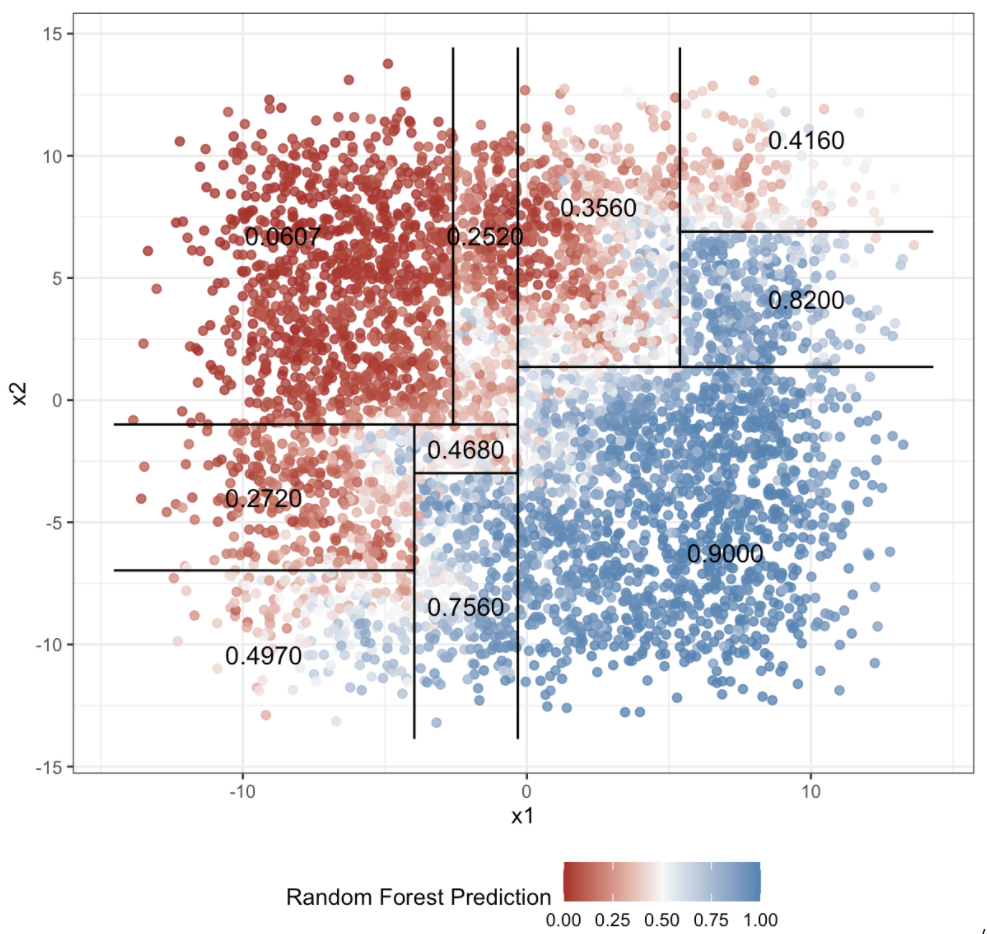
```

```{r out.width = "65%", fig.align = "center", fig.cap = "Trace plot from Urbanek (2008)."}
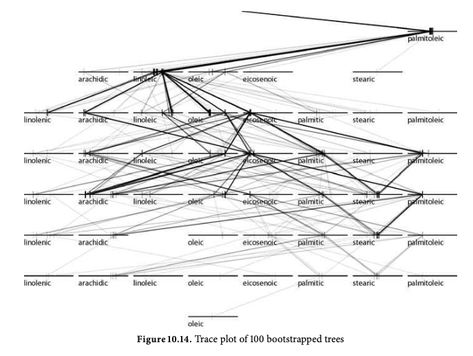
```
]

---

class: middle, center, inverse

# Chapter 3 

## .center[Extensions of Neural Network Explanation Tools to Functional Data]

---

# Application from Sandia National Labs

```{r out.width = "90%", fig.align = "center"}
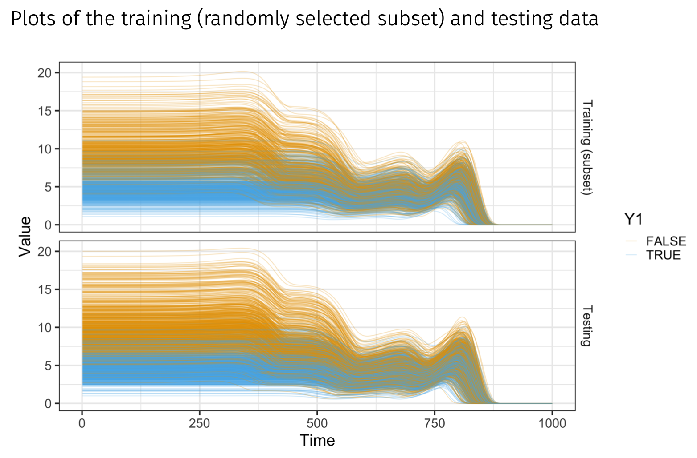
```

```{r out.width = "80%", fig.align = "center"}

```

---

# Current Approach

### Feature Visualization

.pull-left[

**Concept**

- Focus on a "location" in the neural network
- Determine features that maximize the activation function 
- Identify example observation that triggers a part of the network

**Process**

1. Fit a model
2. Fix estimated parameter values
3. Determine values that maximized activation function at desired "location"
]

.pull-right[

<br>

```{r out.width = "70%", fig.align = "center"}
include_graphics("./figures/nn.png")
```

<br>
<br>

.center[.small[Image source: https://en.wikipedia.org/wiki/Artificial_neural_network]]

]

---

# Feature Visualization

```{r out.width = "100%", fig.align = "center"}
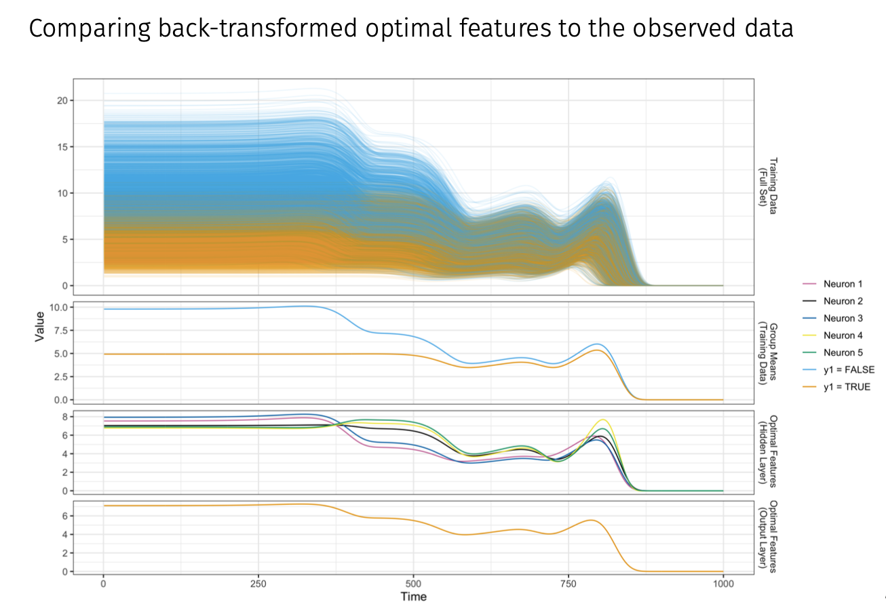
```

---

# Feature Visualization

```{r out.width = "100%", fig.align = "center"}
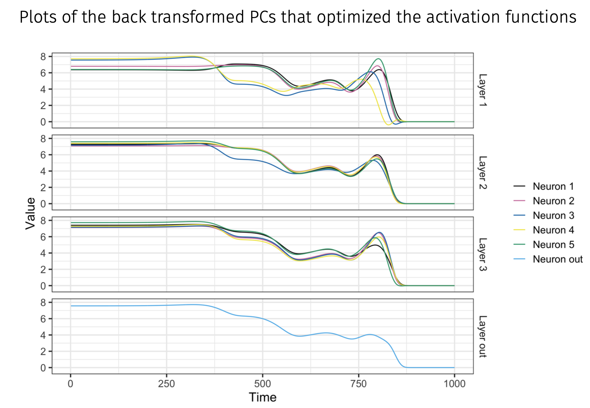
```

---

# Ideas for Future Work  

Feature visualization adjustments
  - Visualize the functional principal components
  
Applications/extensions of other methods
  - Permutation feature importance, saliency maps, and partial dependence plots

Visualizations of the paths of an observation through the network
  - Example: flow `r Citep(bib, "halnaut:2020")`

```{r out.width = "60%", fig.align = "center"}
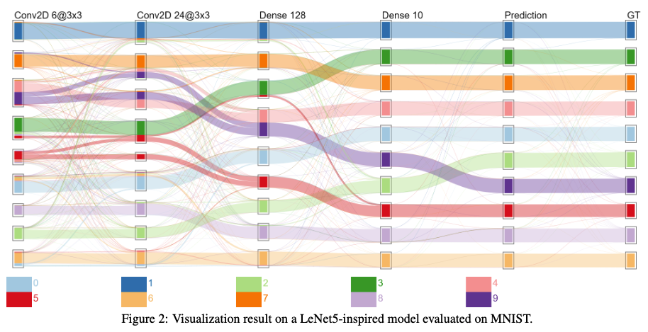
```

---

class: middle, center, inverse

# Timeline and Discussion Points

---

# Timeline for Completion 

**Summer 2020**

- Chapter 1: Finish writing (possibly submit paper)
- Chapter 2: Start on content (if time)
- .blue[Chapter 3: Work on content (Sandia internship)]

**Fall 2020**

- Chapter 1: Submit paper (if not already done)
- .blue[Chapter 2: Work on content]
- .blue[Chapter 3: Write up work]

**Spring 2021**

- Chapter 1: Review process (if applicable)
- .blue[Chapter 2: Write up work]
- Chapter 3: Submit paper (if ready)
- .blue[Defend dissertation]

---

# Publication of Chapter 1

How to divide up the material from chapter 1 for publication?  

Current ideas:

.pull-left[
**Paper 1: Survey paper on LIME**

- Explain LIME in a statistical context
- Use visualizations to help explain the procedure
- Use diagnostic visualizations to assess LIME
- Highlight issues with LIME
- Use iris and sine data
]

.pull-right[
**Paper 2: Diagnostic plots for LIME**

- Motivate assessment of LIME using the bullet matching data (example of high stakes decision using machine learning)
- Demonstrate issues found with LIME explanations using diagnostic plots
- LIME should not be trusted to explain machine learning models when making high stakes decisions 
]

---

class: inverse, center, middle

# References

---

# References

.small[
```{r results = 'asis'}
PrintBibliography(bib, start = 1, end = 22)
```
]

---

# References

.small[
```{r results = 'asis'}
PrintBibliography(bib, start = 23, end = 44)
```
]

---

# References

.small[
```{r results = 'asis'}
PrintBibliography(bib, start = 45)
```
]

---

class: inverse, center, middle

# Appendix

---

# .medium[Additional Bullet Application Plots]

Distribution of the response variable for the random forest features

```{r warning = FALSE, fig.height = 5, fig.width = 7}
bullet_train %>%
  select(all_of(bullet_features), samesource) %>%
  pivot_longer(names_to = "feature",
               values_to = "value",
               all_of(bullet_features)) %>%
  select(feature, value, samesource) %>%
  mutate(feature = fct_recode(feature,
                              "CCF" = "ccf",
                              "CMS" = "cms",
                              "Matches" = "matches",
                              "Mismatches" = "mismatches",
                              "Non-CMS" = "non_cms",
                              "Rough Correlation" = "rough_cor",
                              "Distance" = "D",
                              "Distance Std Dev" = "sd_D",
                              "Sum Peaks" = "sum_peaks")) %>%
  ggplot(aes(x = value, fill = samesource, color = samesource)) +
  geom_histogram(position = "fill", bins = 30) +
  facet_wrap( ~ feature, scales = "free", strip.position = "bottom") +
  labs(x = "",
       y = "Proportion",
       fill = "Same Source?",
       color = "Same Source?",
       title = "Hamby Bullet Training Data") +
  theme_bw(base_family = "Times", base_size = 10) +
  theme(legend.position = "bottom",
        strip.placement = "outside",
        strip.background = element_rect(color = "white",
                                        fill = "white")) +
  scale_color_manual(values = c("grey50", "darkorange")) +
  scale_fill_manual(values = c("grey50", "darkorange"))
```

---

# .medium[Additional Bullet Application Plots]

Bivariate visualizations of the random forest training data

```{r fig.height = 8, fig.width = 8, out.width = "65%", fig.align = "center"}
ggplot(data = bullet_train %>%
         mutate(samesource = as.numeric(samesource)) %>%
         rename("CCF" = "ccf", "CMS" = "cms", "Matches" = "matches",
           "Mismatches" = "mismatches", "Non-CMS" = "non_cms",
           "Rough Correlation" = "rough_cor", "Distance Std Dev" = "sd_D",
           "Distance" = "D", "Sum Peaks" = "sum_peaks")) +
  stat_summary_2d(mapping = aes(x = .panel_x,
                                y = .panel_y,
                                z = samesource),
                  bins = 50,
                  fun = mean) +
  geom_autohistogram() +
  facet_matrix(vars(bullet_features_ordered$feature),
               layer.diag = 2,
               switch = "both") +
  scale_fill_gradient2(low = "grey50",
                       high = "darkorange",
                       midpoint = 0.5) +
  theme_bw(base_family = "Times", base_size = 10) +
  theme(strip.placement = "outside",
        strip.background = element_rect(color = "white",
                                        fill = "white"),
        panel.grid.major = element_blank(),
        panel.grid.minor = element_blank(),
        legend.position = "bottom") +
  labs(fill = "Proportion of Same Source Observations")
```

---

# .medium[Additional Bullet Application Plots]

Random forest variable importance plot

```{r fig.height = 3, fig.width = 5, out.width = "80%", fig.align = "center"}
ggplot(bullet_features_ordered %>%
         mutate(feature = factor(feature, levels = rev(levels(feature)))),
       aes(x = MeanDecreaseGini, y = feature)) +
  geom_col() +
  labs(y = "Feature",
       x = "Variable Importance") +
  theme_bw(base_size = 10, base_family = "Times")
```

---

# .medium[Additional Bullet Application Plots]

Assessment metric plot

```{r message = FALSE, fig.width = 10, fig.height = 6}
# Create a metric comparison plot
metric_plot(bullet_explain %>% mutate(label = as.factor(label))) +
  theme_bw(base_family = "Times") +
  scale_color_gradient(low = "grey10", high = "grey90") +
  labs(color = "Rank \n(within \na metric)")
```

---

# .medium[Additional Bullet Application Plots]

Plots of LIME explanations for one case in the test data that is a known non-match

```{r message = FALSE}
bullet_explain_perms <- bullet_explain_perms %>%
  mutate(case = ifelse(case == bullet_poi_nonmatch,
                       paste(case, "(non-match)"),
                       paste(case, "(match)")))

eoi1_3qb <- eoi_plot(bullet_explain_perms[1:3,], alpha = 0.9, weights = FALSE) +
  scale_color_gradient2(low = "grey50",
                        high = "darkorange",
                        midpoint = 0.5,
                        limits = c(0, 1)) +
  scale_fill_gradient2(low = "grey50",
                        high = "darkorange",
                        midpoint = 0.5,
                        limits = c(0, 1)) +
  theme_bw(base_family = "Times", base_size = 8) +
  theme(strip.placement = "outside",
        strip.background = element_rect(color = "white",
                                        fill = "white"))

eoi2_3qb <- eoi_plot(bullet_explain_perms[4:6,], alpha = 0.9, weights = FALSE) +
  scale_color_gradient2(low = "grey50",
                        high = "darkorange",
                        midpoint = 0.5,
                        limits = c(0, 1)) +
  scale_fill_gradient2(low = "grey50",
                        high = "darkorange",
                        midpoint = 0.5,
                        limits = c(0, 1)) +
  theme_bw(base_family = "Times", base_size = 8) +
  theme(strip.placement = "outside",
        strip.background = element_rect(color = "white",
                                        fill = "white"))

eoi1_3eb <- eoi_plot(bullet_explain_perms[7:9,], alpha = 0.9, weights = FALSE) +
  scale_color_gradient2(low = "grey50",
                        high = "darkorange",
                        midpoint = 0.5,
                        limits = c(0, 1)) +
  scale_fill_gradient2(low = "grey50",
                        high = "darkorange",
                        midpoint = 0.5,
                        limits = c(0, 1)) +
  theme_bw(base_family = "Times", base_size = 8) +
  theme(strip.placement = "outside",
        strip.background = element_rect(color = "white",
                                        fill = "white"))

eoi2_3eb <- eoi_plot(bullet_explain_perms[10:12,], alpha = 0.9, weights = FALSE) +
  scale_color_gradient2(low = "grey50",
                        high = "darkorange",
                        midpoint = 0.5,
                        limits = c(0, 1)) +
  scale_fill_gradient2(low = "grey50",
                        high = "darkorange",
                        midpoint = 0.5,
                        limits = c(0, 1)) +
  theme_bw(base_family = "Times", base_size = 8) +
  theme(strip.placement = "outside",
        strip.background = element_rect(color = "white",
                                        fill = "white"))

eoi1_kd <- eoi_plot(bullet_explain_perms[13:15,], alpha = 0.9, weights = FALSE) +
  scale_color_gradient2(low = "grey50",
                        high = "darkorange",
                        midpoint = 0.5,
                        limits = c(0, 1)) +
  scale_fill_gradient2(low = "grey50",
                        high = "darkorange",
                        midpoint = 0.5,
                        limits = c(0, 1)) +
  theme_bw(base_family = "Times", base_size = 8) +
  theme(strip.placement = "outside",
        strip.background = element_rect(color = "white",
                                        fill = "white"))

eoi2_kd <- eoi_plot(bullet_explain_perms[16:18,], alpha = 0.9, weights = FALSE) +
  scale_color_gradient2(low = "grey45",
                        high = "darkorange",
                        midpoint = 0.5,
                        limits = c(0, 1)) +
  scale_fill_gradient2(low = "grey45",
                        high = "darkorange",
                        midpoint = 0.5,
                        limits = c(0, 1)) +
  theme_bw(base_family = "Times", base_size = 8) +
  theme(strip.placement = "outside",
        strip.background = element_rect(color = "white",
                                        fill = "white"))

pf1_3qb <- plot_features(bullet_explain_perms[1:3,]) +
  scale_fill_manual(values = c("darkorange", "grey50"))
pf2_3qb <- plot_features(bullet_explain_perms[4:6,]) +
  scale_fill_manual(values = c("darkorange", "grey50"))
pf1_3eb <- plot_features(bullet_explain_perms[7:9,]) +
  scale_fill_manual(values = c("darkorange", "grey50"))
pf2_3eb <- plot_features(bullet_explain_perms[10:12,]) +
  scale_fill_manual(values = c("darkorange", "grey50"))
pf1_kd <- plot_features(bullet_explain_perms[13:15,]) +
  scale_fill_manual(values = c("darkorange", "grey50"))
pf2_kd <- plot_features(bullet_explain_perms[16:18,]) +
  scale_fill_manual(values = c("darkorange", "grey50"))
```

```{r fig.width = 12, fig.height = 6}
plot_grid(pf2_3qb, pf2_3eb, pf2_kd,
          eoi2_3qb, eoi2_3eb, eoi2_kd,
          nrow = 2,
          rel_heights = c(0.45, 0.55))
```

---

# .medium[Additional Bullet Application Plots]

Plots of LIME explanations for one case in the test data that is a known match

```{r fig.width = 12, fig.height = 6}
plot_grid(pf1_3qb, pf1_3eb, pf1_kd,
          eoi1_3qb, eoi1_3eb, eoi1_kd,
          nrow = 2,
          rel_heights = c(0.45, 0.55))
```

---

# .medium[Feature Visualization Example Optimization Example]

- Response: $y\in\{0,1\}$
- Features: $$PC = (PC_1, PC_2, PC_3, PC_4, PC_5)$$
- Model: 1 hidden layer, 5 neurons
- Neuron $i$ coefficients $(i=1,...,5)$: $$\left(\beta_{0,i}, \beta_{1,i}, \beta_{2,i}, \beta_{3,i}, \beta_{4,i}, \beta_{5,i}\right)$$
- Activation Function: logistic $$\sigma(v)=\frac{1}{1+e^{-v}}$$
- Feature visualization optimization:

$$\arg\underset{PC}{\max} \ \sigma\left(\hat{\beta}_{0,i} + \hat{\beta}_{1,i}PC_1 +\cdots+\hat{\beta}_{5,i}PC_5\right)$$