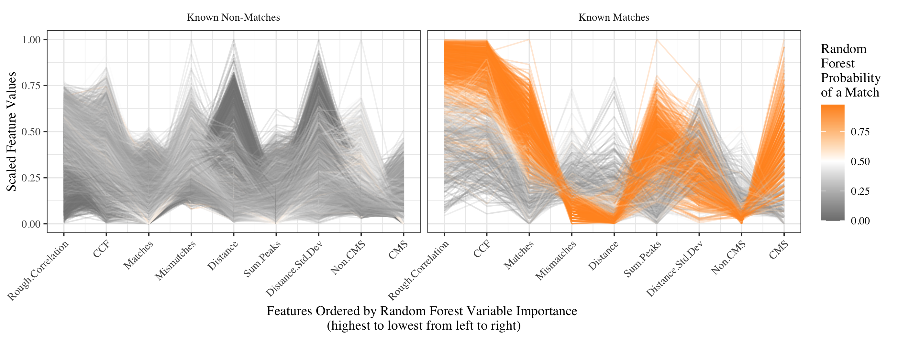

<style>

.remark-slide-content {
  background-color: #FFFFFF;
  border-top: 80px solid #7C2529;
  font-size: 20px;
  font-weight: 300;
  line-height: 1.5;
  padding: 1em 2em 1em 2em
}

.inverse {
  background-color: #6E6259;
  border-top: 80px solid #6E6259;
  text-shadow: none;
}

.remark-slide-content > h1 {
  font-family: 'Songti SC';
  font-weight: normal;
  font-size: 45px;
  margin-top: -95px;
  margin-left: -00px;
  color: #FFFFFF;
}

.title-slide {
  background-color: #FFFFFF;
  border-top: 80px solid #7C2529;
  border-bottom: 20px solid #6E6259;
}

.title-slide > h1  {
  color: #1A292C;
  font-size: 40px;
  text-shadow: none;
  font-weight: 400;
  text-align: left;
  margin-left: 15px;
  padding-top: 80px;
}

body {
  font-family: 'Songti SC';
}

.remark-slide-number {
  font-size: 13pt;
  font-family: 'Songti SC';
  color: #272822;
  opacity: 1;
}
.inverse .remark-slide-number {
  font-size: 13pt;
  font-family: 'Songti SC';
  color: #FAFAFA;
  opacity: 1;
}

.left-desc {
  width: 40%;
  height: 92%;
  float: left;
}
.right-plot {
  width: 59%;
  float: right;
  padding-left: 1%;
}

.tiny{font-size: 30%}
.small{font-size: 50%}
.medium{font-size: 75%}

</style>

```{r setup, echo = FALSE, message = FALSE, warning = FALSE}
# Packages
library(cowplot)
library(dplyr)
library(forcats)
library(ggplot2)
library(glmnet)
library(gower)
library(gretchenalbrecht)
library(knitr)
library(latex2exp)
library(lime)
library(limeaid)
library(purrr)
library(randomForest)
library(RefManageR)
library(tidyr)

# R markdown options
opts_chunk$set(echo = FALSE, dpi = 200, cache = FALSE)

# Biboptions
BibOptions(check.entries = FALSE,
           bib.style = "authoryear",
           cite.style = "authoryear",
           style = "markdown",
           hyperlink = FALSE,
           dashed = FALSE)
myBib <- ReadBib("references.bib", check = FALSE)

# Plot theme
gg_procedure <- list(theme_bw(base_family = "Times", base_size = 14),
                     theme(aspect.ratio = 1)) 
```

# Questions/Notes

Questions: 

- How much text is appropriate on a slide during an oral prelim?
- Complete sentences or not for the oral prelim?
- Are the references formatted okay?
- How much time should I spend discussing previous explainable machine learning methods/how many should I mention?
- Title?
- Should I say I'm focusing on "explainable machine learning" or "visualization techniques for explainable machine learning"

Ideas:

- Could turn explainable machine learning methods into a visualization or table to make it more digestible

Notes: 

- Remember to send out before prelim
- 50 minute talk

---

# Personal Background

.pull-left[
**Education**

B.A. in Mathematics
  - Lawrence University (Appleton, WI)
  - Graduated in June 2013
  
M.S. in Statistics 
  - University of Wisconsin, Madison
  - Graduated in May 2015
  
Ph.D. in Statistics (in progress)
  - Iowa State University
  - Started in January 2016
]

.pull-right[

**Assistantships/Internship**

- Lecturer for STAT 101 
  - Spring 2016
- AES Statistical Consultant 
  - Summer 2016 - current
- NREM Research Assistant 
  - Summer 2019
  
**Internship**

Sandia National Labs
  - Statistical Sciences Research and Development Intern
  - December 2019 - current
]

---

# Overview of Talk

1. Background and Overview of Thesis

2. Detailed explanation of Chapter 1
  - Visual Diagnostics of a Model Explainer -- Tools for the Assessment of LIME Explanations

3. Plan for Chapter 2
  - Explaining Random Forests using Clustering of Trees

4. Ideas for Chapter 3
  - Extensions of Neural Network Explanation Tools to Tabular Data Applications

5. Timeline for Completion

6. Discussion Points

---

class: middle, center, inverse

# Background and Overview of Thesis

---

# Explainable Machine Learning

- Many machine learning models are considered "black-boxes", because it is not possible to directly interpret them. 

- An area of research in explainable machine learning has developed as a result .medium[`r Citep(myBib, c("gilpin:2018", "guidotti:2018", "ming:2017", "mohseni:2018", "molnar:2019", "samek:2019"))`].

- The goal with explainable machine learning is to provide methods to explain predictions made by black-box models.

- The European General Data Protection Regulation (GDPR) implemented in 2018 includes a "right to explanation", which is pertinent to the way in which machine learning models are used in Europe `r Citep(myBib, "goodman:2016")`.

  - `r Citet(myBib, "goodman:2016")` point out, "It is reasonable to suppose that any adequate explanation would, at a minimum, provide an account of how input features relate to predictions, allowing one to answer questions such as: Is the model more or less likely to recommend a loan if the applicant is a minority?"

---

# Explainability versus Interpretability

There are no accepted definitions for *explainability* and *interpretability* in the literature .small[`r Citep(myBib, c("gilpin:2018", "lipton:2016", "molnar:2019", "montavon:2017", "murdoch:2019", "rudin:2018"))`]. I will use the following definitions.

.pull-left[
**Interpretability** is the ability to directly use the parameters of a model to understand the mechanism of how the model makes predictions.

- A linear model coefficient indicates the amount the response variable changes based on a change in the predictor variable when all other predictor variables are held constant.
  
$$\hat{y}=\hat{\beta}_0+\hat{\beta}_1x_1+\cdots+\hat{\beta}_px_p $$
]

.pull-right[
**Explainability** is the ability to use the model in an indirect manner to understand the relationships in the data captured by the model.

- LIME uses a surrogate model to understand the relationship between the complex model predictions and predictor variables in a local region `r Citep(myBib, "ribeiro:2016")`.

```{r out.width = "65%", fig.align = "center"}
include_graphics("figures/lime.png")
```

]

---

# Model Agnostic Methods

.pull-left[
**General Model Visualizations**

.medium[
- Removing the blindfold .medium[`r Citep(myBib, "wickham:2015")`]
  - Plot the model in dataspace
  - Plot members of a model collection
  - Explore the fitting process
]

**Global Methods**

.medium[
- Partial dependence plots .medium[`r Citep(myBib, "friedman:2001")`] and extensions:
  - Interactive partial dependence plots .medium[`r Citep(myBib, "krause:2016")`]
  - Individual conditional expectation plots .medium[`r Citep(myBib, "goldstein:2013")`]
  - Accumulated local effect plots .medium[`r Citep(myBib, "apley:2016")`]
  - Feature interaction plots .medium[`r Citep(myBib, c("friedman:2008", "greenwell:2018", "hooker:2004"))`]
- Parallel coordinate plots .medium[`r Citep(myBib, "jiang:2019")`]
- Global feature importance plots .medium[`r Citep(myBib, c("fisher:2018", "altmann:2010", "casalicchio:2019"))`]
- Global surrogate models .medium[`r Citep(myBib, "molnar:2019")`]
]
]

.pull-right[
**Local Methods**

.medium[
- Individual conditional importance plots .medium[`r Citep(myBib, "casalicchio:2019")`]
- LIME .medium[`r Citep(myBib, "ribeiro:2016")`]
- Anchors (scoped rules) .medium[`r Citep(myBib, "ribeiro:2018")`]
- Shapely values .medium[`r Citep(myBib, "štrumbelj:2014")`]
- SHAP .medium[`r Citep(myBib, "lundberg:2017")`]
- breakDown .medium[`r Citep(myBib, "staniak:2018")`]
]

**Example Based Explanations**

.medium[
- Counterfactual examples .medium[`r Citep(myBib, c("wachter:2017", "martens:2014", "looveren:2019", "laugel:2017"))`]
- Adversarial examples .medium[`r Citep(myBib, c("szegedy:2013", "goodfellow:2014", "biggio:2018"))`]
- Prototypes and criticisms .medium[`r Citep(myBib, "kim:2016")`]
- Influential instances .medium[`r Citep(myBib, "koh:2017")`]
]
]

---

# Model Specific Methods

.pull-left[
**Random Forests**

.medium[
- Random forest impurity based feature importance .medium[`r Citep(myBib, "breiman:2001")`]
- Sectioned scatterplots .medium[`r Citep(myBib, "urbanek:2008")`]
- Trace plots of trees .medium[`r Citep(myBib, "urbanek:2008")`]
- Simplified model .medium[`r Citep(myBib, "hara:2016")`]
- Forest floor visualizations .medium[`r Citep(myBib, "welling:2016")`]
- Interactive visualizations .medium[`r Citep(myBib, c("beckett:2018", "dasilva:2017"))`]
]

**Neural Networks**

.medium[
- Extracting tree structures .medium[`r Citep(myBib, "craven:1996")`]
- Saliency maps .medium[`r Citep(myBib, "simonyan:2013")`]
- Feature visualization .medium[`r Citep(myBib, "olah:2017")`]
- Grand tours .medium[`r Citep(myBib, "li:2020")`]
- Flows .medium[`r Citep(myBib, "halnaut:2020")`]
]
]

.pull-right[
```{r out.width = "60%", fig.align = "center", fig.cap = "Sectioned scatterplot from Urbanek (2008)."}

```

```{r out.width = "60%", fig.align = "center", fig.cap = "Saliency maps from Simonyan, Vedaldi, and Zisserman (2013)."}
knitr::include_graphics("./figures/saliency.png")
```
]

---

# .medium[Assessment of Explainable Machine Learning Methods]

**General Assessment**

- `r Citet(myBib, "rudin:2018")` argues against the use of black-box models to make high stakes decisions since all "explanations must be wrong". `r Citet(myBib, "rudin:2018")` also makes the following claims:

  - The trade-off between accuracy and interpretability is a myth
  - Interpretable models can have just as good accuracy as "black-box" models
  - Explanations may not be faithful to the original model, make sense, or be detailed enough to understand the "black-box" model

**Method Specific Assessments**

- `r Citet(myBib, "laugel:2018")` consider how to appropriately choose a local region for the local surrogate model with the method of LIME.
- `r Citet(myBib, "laugel:2018")` consider issues with unjustified counterfactual examples.
- `r Citet(myBib, "kindermans:2017")` show how saliency maps can change when a transformation is applied to the input data that has no effect on the model.

---

# Overview of Dissertation Chapters

**Chapter 1**

- Focus on the model-agnostic explainer model method of LIME
- Discuss the importance of assessing LIME explanations
- Suggest the use of visualizations for the assessment of LIME and provide many example visualizations

**Chapter 2**

- Visualizations for the explainability of random forest models
- Use clustering to identify key tree structures within the random forest

**Chapter 3**

- Visualizations for the explainability of neural networks with functional data

---

class: middle, center, inverse

# Chapter 1: Visual Diagnostics of a Model Explainer -- Tools for the Assessment of LIME Explanations

---

# Motivation

.pull-left[
`r Citet(myBib, "hare:2016")`:
- Interested in providing quantitative evidence to determine whether two bullets were fired from the same gun
- Use high definition scans of striations on bullet lands to extract "signatures" 
- Compute similarity features to compare two signatures
]

.pull-right[
```{r out.width = "50%"}
include_graphics("figures/gun.png")

```
]

```{r out.width = "50%"}
include_graphics("figures/striae.png")

```

---
 
# Motivation

`r Citet(myBib, "hare:2016")` fit a random forest model with nine signature similarity features.

```{r out.width = "85%", fig.align = "center"}

```

```{r}
rtrees_conf = bulletxtrctr::rtrees$confusion
colnames(rtrees_conf) = c("FALSE", "TRUE", "Classification Error")
kableExtra::kable(rtrees_conf)
```

---

# Motivation

We were interested in providing an explanation for specific signatures comparisons, so we tried applying LIME. However, we found unreasonable results, which led to an assessment of LIME.

```{r fig.width = 7, fig.height = 5, out.width = "85%", message = FALSE, fig.align = "center"}
# Load the hamby data
bullet_train <- read.csv("../lime/data/hamby173and252_train.csv")
bullet_test <- read.csv("../lime/data/hamby224_test.csv")

# Extract the features and order them based on feature importance
bullet_features <- rownames(bulletxtrctr::rtrees$importance)

# Load the files
bullet_explain_noperms <- readRDS("../lime/data/hamby_explain.rds")

# Specify two cases of interest
bullet_poi_match <- unique(bullet_explain_noperms$case)[c(325)]
bullet_poi_nonmatch <- unique(bullet_explain_noperms$case)[c(20)]

# Apply LIME to two cases with the permutations returned
bullet_lime_explain_perms <- apply_lime(
  train = bullet_train %>% select(all_of(bullet_features)),
  test = bullet_test %>%
    filter(case %in% bullet_poi_match) %>%
    bind_rows(bullet_test %>%
    filter(case %in% bullet_poi_nonmatch)) %>%
    select(all_of(bullet_features)),
  model = bulletxtrctr::rtrees,
  label = as.character(TRUE),
  n_features = 3,
  sim_method = c('quantile_bins', 'equal_bins', 'kernel_density', 'normal_approx'),
  nbins = 3,
  feature_select = "auto",
  dist_fun = "gower",
  kernel_width = NULL,
  gower_pow = 0.5,
  return_perms = TRUE,
  all_fs = FALSE,
  seed = 20190914)

# Separate the lime and explain parts of the results
bullet_lime_perms <- bullet_lime_explain_perms$lime
bullet_explain_perms <- bullet_lime_explain_perms$explain %>%
  mutate(case = ifelse(case == 1,
                       bullet_poi_match,
                       bullet_poi_nonmatch))

# Determine the implementation and case number of the poi
# in the no_perms data
poi_cases_no_perms <- bullet_explain_noperms %>%
  filter(case %in% c(bullet_poi_match, bullet_poi_nonmatch),
         nbins %in% c(3, NA),
         gower_pow == 0.5) %>%
  select(case, implementation) %>%
  unique()

# Join the no perms data (with poi removed) with the
# perms data (perms removed)
bullet_explain <- bullet_explain_noperms %>%
  anti_join(poi_cases_no_perms,
            by = c("implementation", "case")) %>%
  bind_rows(bullet_explain_perms %>%
              select(-perms_raw, -perms_numerified,
                     -perms_pred_simple, -perms_pred_complex,
                     -weights))

bullet_explain %>%
  filter(sim_method == "quantile_bins",
         gower_pow == 1,
         case == bullet_poi_nonmatch,
         nbins == 4) %>%
  mutate(case = "20, 4 quantile bins (default method)") %>%
  plot_features() +
  scale_fill_manual(values = c("darkorange", "grey50"))
```

---

# Conceptual Depiction of LIME

LIME was introduced by `r Citet(myBib, "ribeiro:2016")`.

- **L**ocal
- **I**nterpretable
- **M**odel-agnostic
- **E**xplanation

**Concept**: Explain the prediction made by a complex model for *one prediction of interest* using an interpretable model focused on a local region near the prediction of interest

```{r}
# Simulate example data
set.seed(20190624)
lime_data <-
  data.frame(
    feature1 = sort(runif(250, 0, 1)),
    feature2 = sample(x = 1:250, size = 250, replace = FALSE)) %>%
  mutate(
    feature1_stnd = (feature1 - mean(feature1)) / sd(feature1),
    feature2_stnd = (feature2 - mean(feature2)) / sd(feature2),
    prediction = if_else(feature1 >= 0 & feature1 < 0.1,
                         (0.3 * feature1) + rnorm(n(), 0, 0.01),
                 if_else(feature1 >= 0.1 & feature1 < 0.3,
                         rbeta(n(), 1, 0.5),
                 if_else(feature1 >= 0.3 & feature1 < 0.5,
                         sin(pi* feature1) + rnorm(n(), 0, 0.5),
                 if_else(feature1 >= 0.5 & feature1 < 0.8,
                         -(sin(pi* feature1) + rnorm(n(), 0, 0.1)) + 1,
                 if_else(feature1 >= 0.8 & feature1 < 0.9,
                         0.5 + runif(n(), -0.5, 0.5),
                         0.5 + rnorm(n(), 0, 0.3))))))) %>%
  bind_rows(
    data.frame(feature1 = rep(1, 30) + rnorm(5, 0, 0.05),
           feature2 = rep(245, 30) + rnorm(5, 0, 1),
           prediction = rep(0, 30) + rnorm(5, 0, 0.05)) %>%
  mutate(feature1_stnd = (feature1 - mean(feature1)) / sd(feature1),
         feature2_stnd = (feature2 - mean(feature2)) / sd(feature2)))

# Specify a prediction of interest
prediction_of_interest <-
  data.frame(feature1 = 0.07, feature2 = 200) %>%
  mutate(feature1_stnd = (feature1 - mean(lime_data$feature1)) /
           sd(lime_data$feature1),
         feature2_stnd = (feature2 - mean(lime_data$feature2)) /
           sd(lime_data$feature2),
         prediction = 0.05,
         color = factor("Prediction \nof Interest"))

# Specify the gower exponents
good_gower_power <- 50
bad_gower_power <- 1

# Compute the good distances between the prediction of interest
# and all other observations
lime_data$distance_good <-
  (1 - gower_dist(x = prediction_of_interest %>%
                    select(feature1_stnd, feature2_stnd),
                  y = lime_data %>%
                    select(feature1_stnd,
                           feature2_stnd)))^good_gower_power

# Compute the bad distances between the prediction of interest
# and all other observations
lime_data$distance_bad <-
  (1 - gower_dist(x = prediction_of_interest %>%
                    select(feature1_stnd, feature2_stnd),
                  y = lime_data %>%
                    select(feature1_stnd,
                           feature2_stnd)))^bad_gower_power

# Prepare the data for plotting
lime_data_gathered <- lime_data %>%
  gather(feature, feature_stnd_value,
         feature1_stnd:feature2_stnd) %>%
  gather(distance, distance_value, distance_good:distance_bad) %>%
  mutate(distance = fct_recode(distance,
                               "good" = "distance_good",
                               "bad" = "distance_bad"),
         feature = fct_recode(feature,
                              "Feature 1" = "feature1_stnd",
                              "Feature 2" = "feature2_stnd"))

# Prepare the prediction of interest data for plotting
prediction_of_interest_gathered <- prediction_of_interest %>%
  select(-feature1, -feature2) %>%
  gather(feature, feature_value, feature1_stnd, feature2_stnd) %>%
  mutate(feature = fct_recode(feature,
                              "Feature 1" = "feature1_stnd",
                              "Feature 2" = "feature2_stnd"))

# Fit the good interpretable explainer model
explainer_good <-
  glmnet(x = lime_data %>% select(feature1_stnd, feature2_stnd)
         %>% as.matrix(),
         y = lime_data$prediction,
         alpha = 0,
         lambda = 1,
         weights = lime_data$distance_good)

# Fit the bad interpretable explainer model
explainer_bad <-
  glmnet(x = lime_data %>% select(feature1_stnd, feature2_stnd)
         %>% as.matrix(),
         y = lime_data$prediction,
         alpha = 0,
         lambda = 1,
         weights = lime_data$distance_bad)

# Join the coefficients from the explainer model into a dataframe
coefs_data <- data.frame(case = c("good", "bad"),
                         b0 = c(coef(explainer_good)[1],
                                coef(explainer_bad)[1]),
                         b1 = c(coef(explainer_good)[2],
                                coef(explainer_bad)[2]),
                         b2 = c(coef(explainer_good)[3],
                                coef(explainer_bad)[3])) %>%
  mutate(feature1 = b0 + b2*prediction_of_interest$feature2_stnd,
         feature2 = b0 + b1*prediction_of_interest$feature1_stnd) %>%
  gather(key = feature, value = int, feature1:feature2) %>%
  mutate(slope = c(coef(explainer_good)[2],
                   coef(explainer_good)[3],
                   coef(explainer_bad)[2],
                   coef(explainer_bad)[3]),
         feature = fct_recode(feature,
                              "Feature 1" = "feature1",
                              "Feature 2" = "feature2"))
```

```{r fig.width = 8, fig.height = 3, warning = FALSE}
# Plot of good explainer model
ggplot() +
  facet_grid(. ~ feature, switch = "x") +
  geom_point(data = lime_data_gathered,
             mapping = aes(x = feature_stnd_value,
                           y = prediction,
                           size = distance_value,
                           alpha = distance_value,
                           color = distance)) +
  geom_abline(data = coefs_data %>% filter(case == "good"),
              mapping = aes(intercept = int, slope = slope),
              size = 1) +
  scale_alpha(range = c(0.3, 1)) +
  scale_color_manual(values = c(NA, "grey30"), guide = FALSE) +
  geom_point(data = prediction_of_interest_gathered,
             mapping = aes(x = feature_value,
                           y = prediction,
                           fill = color),
             color = "black",
             size = 5,
             shape = 23,
             alpha = 0.75) +
  scale_fill_manual(values = "#FAAA72") +
  geom_text(
    data = data.frame(feature_stnd_value = 1.2,
                      prediction = 1.6,
                      feature = c("Feature 1", "Feature 2"),
                      slope = c(paste("Slope:",
                                      coefs_data %>%
                                        filter(case == "good",
                                               feature == "Feature 1") %>%
                                        pull(slope) %>%
                                        round(3)),
                                paste("Slope:",
                                      coefs_data %>%
                                        filter(case == "good",
                                               feature == "Feature 2") %>%
                                        pull(slope) %>%
                                        round(3)))),
    mapping = aes(x = feature_stnd_value,
                  y = prediction,
                  label = slope),
    family = "Times",
    size = 4) +
  labs(x = "",
       y = "Black-Box Prediction",
       #title = "Conceptual Depiction of a Faithful Local Explainer Model",
       #subtitle = paste("Gower Distance Metric Exponent:", good_gower_power),
       fill = "",
       alpha = "Weight",
       size = "Weight") +
  theme_linedraw(base_family = "Times", base_size = 14) +
  theme(panel.grid.major = element_blank(),
        panel.grid.minor = element_blank(),
        axis.text.x = element_blank(),
        axis.ticks.x = element_blank(),
        axis.text.y = element_blank(),
        axis.ticks.y = element_blank(),
        strip.placement = "outside",
        strip.background = element_rect(color = "white", fill = "white"),
        strip.text = element_text(color = 'black', size = 10)) +
  guides(fill = guide_legend(order = 1),
         size = guide_legend(order = 2),
         alpha = guide_legend(order = 2))
```

---

# Importance of Assessing LIME

LIME adds an additional layer of complexity by using a model that also needs to be assessed, which raises various questions:

- Does the explainer model approximate the complex model well in a local region around the prediction of interest?
- How to determine an appropriate local region?
- Is the relationship linear in the specified local region?

<br>

```{r fig.width = 8, fig.height = 3, warning = FALSE}
# Plot of good explainer model
ggplot() +
  facet_grid(. ~ feature, switch = "x") +
  geom_point(data = lime_data_gathered,
             mapping = aes(x = feature_stnd_value,
                           y = prediction,
                           size = distance_value,
                           alpha = distance_value,
                           color = distance)) +
  geom_abline(data = coefs_data %>% filter(case == "bad"),
              mapping = aes(intercept = int, slope = slope),
              size = 1) +
  scale_alpha(range = c(0.3, 1)) +
  scale_color_manual(values = c("grey30", NA), guide = FALSE) +
  geom_point(data = prediction_of_interest_gathered,
             mapping = aes(x = feature_value,
                           y = prediction,
                           fill = color),
             color = "black",
             size = 5,
             shape = 23,
             alpha = 0.75) +
  scale_fill_manual(values = "#FAAA72") +
  geom_text(
    data = data.frame(feature_stnd_value = 1.2,
                      prediction = 1.6,
                      feature = c("Feature 1", "Feature 2"),
                      slope = c(paste("Slope:",
                                      coefs_data %>%
                                        filter(case == "bad",
                                               feature == "Feature 1") %>%
                                        pull(slope) %>%
                                        round(3)),
                                paste("Slope:",
                                      coefs_data %>%
                                        filter(case == "bad",
                                               feature == "Feature 2") %>%
                                        pull(slope) %>%
                                        round(3)))),
    mapping = aes(x = feature_stnd_value,
                  y = prediction,
                  label = slope),
    family = "Times",
    size = 4) +
  labs(x = "",
       y = "Black-Box Prediction",
       #title = "Conceptual Depiction of an Unfaithful Local Explainer Model",
       #subtitle = paste("Gower Distance Metric Exponent:", bad_gower_power),
       fill = "",
       alpha = "Weight",
       size = "Weight") +
  theme_linedraw(base_family = "Times", base_size = 14) +
  theme(panel.grid.major = element_blank(),
        panel.grid.minor = element_blank(),
        axis.text.x = element_blank(),
        axis.ticks.x = element_blank(),
        axis.text.y = element_blank(),
        axis.ticks.y = element_blank(),
        strip.placement = "outside",
        strip.background = element_rect(color = "white", fill = "white"),
        strip.text = element_text(color = 'black', size = 10)) +
  guides(fill = guide_legend(order = 1),
         size = guide_legend(order = 2),
         alpha = guide_legend(order = 2))
```

---

# Visualizations for Model Assessment

`r Citet(myBib, "ribeiro:2016")` make the following set of claims regarding the performance of LIME:

- *Interpretability*: Easy to interpret the explainer model to provide meaningful explanations

- *Faithfulness*: Explainer model sufficiently captures the relationship between the complex model predictions and the features in the local region around a prediction of interest

- *Linearity*: Using a ridge regression as the explainer model assumes a linear relationship between complex model predictions and the features

- *Localness*: Explanations are local in regards to a prediction of interest

We suggest the use of visualizations to assess the claims made by LIME, which we have organized into three categories:

- *Diagnostics for individual explanations*
- *Diagnostics for sets of explanations*
- *Diagnostics for comparisons of tuning parameters*

---

# Sine Example Data

```{r}
# Functions for rotating the data
rot_x <- function(x, y, theta) (x * cos(theta)) - (y * sin(theta))
rot_y <- function(x, y, theta) (x * sin(theta)) + (y * cos(theta))

# Generate the data
theta = -0.9
min = -10
max = 10
set.seed(20190913)
sine_data <- data.frame(x1 = runif(600, min, max),
                        x2 = sort(runif(600, min, max))) %>%
  mutate(x1new = rot_x(x1, x2, theta),
         x2new = rot_y(x1, x2, theta),
         y = ifelse(x2new > 5 * sin(x1new), "blue", "red")) %>%
  slice(sample(1:n())) %>%
  mutate(x3 = rnorm(600),
         case = 1:600) %>%
  select(case, everything())

# Separte the data into training and testing parts
set.seed(20191003)
rs <- sample(1:600, 500, replace = FALSE)
sine_data_train <- sine_data[rs,]
sine_data_test <- sine_data[-rs,]

# Fit a random forest
set.seed(20191003)
rfsine <- randomForest(x = sine_data_train %>% select(x1, x2, x3),
                       y = factor(sine_data_train$y))

# Obtain predictions on the training and testing data
sine_data_train$rfpred <- predict(rfsine)
sine_data_train <- cbind(sine_data_train, predict(rfsine, type = "prob"))
sine_data_train <- sine_data_train %>% 
  rename(rfprob_blue = blue, rfprob_red = red)
sine_data_test$rfpred <- predict(rfsine, sine_data_test %>% select(x1, x2, x3))
sine_data_test <- cbind(sine_data_test,
                        predict(rfsine, sine_data_test
                                %>% select(x1, x2, x3),
                                type = "prob"))
sine_data_test <- sine_data_test %>% 
  rename(rfprob_blue = blue, rfprob_red = red)

# Extract the prediction of interest from the sine test data
sine_poi <- sine_data_test %>% filter(y != rfpred, x1 > 0, x1 < 5, x2 > 5)
```

.pull-left[
Training data: 500 observations  
Testing data: 100 observations  
Black-box model: random forest
  
$x_1\sim Unif($ `r min`, `r max` $)$  
$x_2\sim Unif($ `r min`, `r max` $)$  
$x_3\sim \mbox{N}(0,1)$
]

.pull-right[
$$y=\begin{cases}  blue & \mbox{ if } x'_2 > \sin\left(x'_1\right) \\
  red & \mbox{ if } x'_2 \le \sin\left(x'_1\right) \ . %\nolabel
  \end{cases}$$
where  
$x'_1=x_1\cos(\theta)-x_2\sin(\theta)$   
$x'_2=x_1\sin(\theta)+x_2\cos(\theta)$   
$\theta=-0.9$
]

```{r fig.width = 8, fig.height = 3.125}
# Create points represting the rotated since curve
sinefun_data <- data.frame(xnew = seq(min(sine_data$x1new),
                                      max(sine_data$x1new),
                                      by = 0.01)) %>%
  mutate(ynew = 5 * sin(xnew)) %>%
  mutate(x = rot_x(xnew, ynew, -theta),
         y = rot_y(xnew, ynew, -theta)) %>%
  filter(y >= -10, y <= 10)

# Specify colors for predictions
sinecolor_red = "firebrick"
sinecolor_blue = "steelblue"

# Plot the training data observed classes
sine_plot_obs <- ggplot(sine_data_train, aes(x = x1, y = x2, color = y)) +
  geom_point(alpha = 0.8) +
  geom_path(data = sinefun_data, aes(x = x, y = y),
            color = "black") +
  scale_colour_manual(values = c(sinecolor_blue, sinecolor_red)) +
  theme_bw(base_family = "Times", base_size = 10) +
  labs(x = TeX("$x_1$"),
       y = TeX("$x_2$"),
       color = TeX("y"),
       title = "Training Data")

# Plot the testing data rf predictions
sine_plot_pred <- ggplot() +
  geom_point(data = sine_poi %>%
               mutate(shape = "Prediction \nof Interest"),
             mapping = aes(x = x1,
                           y = x2,
                           #fill = rfprob_blue,
                           shape = shape),
             size = 5,
             alpha = 0.8,
             color = "black") +
  geom_point(data = sine_data_test %>% filter(y != rfpred),
             mapping = aes(x = x1, y = x2),
             shape = 1,
             size = 3,
             color = "black") +
  geom_point(data = sine_data_test,
             mapping =  aes(x = x1,
                            y = x2,
                            color = rfprob_blue,
                            fill = rfprob_blue),
             shape = 21,
             alpha = 0.8) +
  geom_path(data = sinefun_data, aes(x = x, y = y),
            color = "black") +
  scale_color_gradient2(low = sinecolor_red,
                        mid = '#f7f7f7',
                        high = sinecolor_blue,
                        midpoint = 0.5) +
  scale_fill_gradient2(low = sinecolor_red,
                        mid = '#f7f7f7',
                        high = sinecolor_blue,
                        midpoint = 0.5) +
  scale_shape_manual(values = 23) +
  theme_bw(base_family = "Times", base_size = 10) +
  labs(x = TeX("$x_1$"),
       y = TeX("$x_2$"),
       color = "Random \nForest \nProbability \nfor 'blue'",
       fill = "Random \nForest \nProbability \nfor 'blue'",
       title = "Testing Data",
       shape = "") +
  guides(shape = guide_legend(order = 1))

# Join the plots
plot_grid(sine_plot_obs, sine_plot_pred,
          nrow = 1,
          rel_widths = c(0.4825, 0.5175))
```

---

# Diagnostics for Individual Explanations

Overview visualization of the LIME explanation for the prediction of interest from the *lime* R package

```{r}
# Apply LIME with various tuning parameters to the sine data
sine_lime_explain <- readRDS("../lime/data/sine_lime_explain.rds")

# Extract the explanations from the default lime implementation
sine_lime_default <- sine_lime_explain$explain %>% filter(nbins == 4)

# Extract the explanations from the default lime implementation
# for the prediction of interest only
sine_poi_lime_default <- sine_lime_default %>%
  filter(case == sine_poi %>% pull(case)) %>%
  mutate(case = c("Prediction of Interest", "Prediction of Interest"))
```

```{r fig.width = 6, fig.height = 4, out.width = "80%", fig.align = "center"}
sine_poi_exp <- sine_poi_lime_default %>% plot_features()
sine_poi_exp
```

---

# Diagnostics for Individual Explanations

.left-desc[
**Step 1a**: Data Simulation

*lime* R package default procedure:

- Sample 4999 observations uniformly from 4 quantile bins for each feature in the training data 
  
**Corresponding Diagnostic:**  
*Training Data Plot*

- Scatterplot of the two features selected by *lime*
- Points are the training data observations colored by the observed response
- Grid of lines represents the boundaries of the 4 quantile bins
]

.right-plot[
```{r warning = FALSE}
# Determine the bin cuts for the default lime implementation
sine_lime_default_bin_cuts <- sine_lime_default %>%
  select(feature, feature_desc) %>%
  unique() %>%
  separate(feature_desc, c("other", "bin_cut"), sep = " <= ") %>%
  select(-other) %>%
  na.omit() %>%
  mutate(bin_cut = as.numeric(bin_cut)) %>%
  arrange(feature) %>%
  mutate(case = rep(1:3, 2)) %>%
  spread(feature, bin_cut)

# Plot the training data with observed classes and the
# four quantile bins associated with each feature
ggplot() +
  geom_point(data = sine_data_train,
             mapping = aes(x = x1, y = x2, color = y),
             alpha = 0.8) +
  geom_vline(xintercept = sine_lime_default_bin_cuts$x1) +
  geom_hline(yintercept = sine_lime_default_bin_cuts$x2) +
  scale_color_manual(values = c(sinecolor_blue, sinecolor_red)) +
  scale_fill_manual(values = c(sinecolor_blue, sinecolor_red)) +
  scale_shape_manual(values = 23) +
  labs(x = TeX("$x_1$"),
       y = TeX("$x_2$"),
       color = TeX("y"),
       fill = TeX("y"),
       shape = "",
       title = "Training Data Plot") +
  guides(shape = guide_legend(order = 1),
         fill = FALSE) + 
  gg_procedure
```
]

---

# Diagnostics for Individual Explanations

.left-desc[
**Step 1b**: Complex Model Predictions
  
- Apply complex model to simulated data to obtain predictions

**Corresponding Diagnostic:** *Untransformed Simulated Data Plot*

- Scatterplot of the simulated data features denoted by $x'_1$ and $x'_2$
- Points are colored by the random forest predictions (for 'blue')
- Grid of lines represents the boundaries of the 4 quantile bins
- Prediction of interest location indicated by the diamond
]

.right-plot[
```{r warning = FALSE}
# Obtain the simulated data associated with the poi
sine_poi_perms <- sine_poi_lime_default %>%
  slice(1) %>%
  select(perms_raw, perms_pred_complex, perms_numerified, weights) %>%
  mutate(perms_numerified =
           map(perms_numerified,
               .f = function(x) rename(x,
                                       "x1num" = "x1",
                                       "x2num" = "x2",
                                       "x3num" = "x3"))) %>%
  unnest(cols = c(perms_raw, perms_pred_complex, perms_numerified, weights)) %>%
  select(-red) %>%
  rename(rfpred = blue) %>%
  mutate(case = factor(1:n())) %>%
  select(case, everything())

# Plot the permutations associated with the prediction of interest
ggplot() +
  geom_point(data = sine_poi_perms,
             mapping = aes(x = x1,
                           y = x2,
                           fill = rfpred,
                           color = rfpred),
             alpha = 0.8,
             shape = 21,
             size = 0.75) +
  geom_vline(xintercept = sine_lime_default_bin_cuts$x1) +
  geom_hline(yintercept = sine_lime_default_bin_cuts$x2) +
  geom_point(data = sine_poi %>% mutate(shape = "Prediction \nof Interest"),
             mapping = aes(x = x1,
                           y = x2,
                           fill = rfprob_blue,
                           shape = shape),
             color = "black",
             size = 5,
             alpha = 0.8) +
  scale_fill_gradient2(low = sinecolor_red,
                        mid = '#f7f7f7',
                        high = sinecolor_blue,
                        midpoint = 0.5) +
  scale_color_gradient2(low = sinecolor_red,
                        mid = '#f7f7f7',
                        high = sinecolor_blue,
                        midpoint = 0.5) +
  scale_shape_manual(values = 23) +
  labs(x = TeX("$x'_1$"),
       y = TeX("$x'_2$"),
       fill = "Random \nForest \nProbability \nfor 'blue'",
       color = "Random \nForest \nProbability \nfor 'blue'",
       shape = "",
       title = "Untransformed Simulated Data Plot") +
  guides(shape = guide_legend(order = 1)) + 
  gg_procedure
```
]
---

# Diagnostics for Individual Explanations

.left-desc[
**Step 1c**: Interpretability Transformation

- Convert continuous features to binary variables based on whether the observation falls in the same quantile bin as the prediction of interest or not

**Corresponding Diagnostic:** *Interpretability Transformed Simulated Data Plot*

- Scatterplot of the simulated data features
- Rectangular region shades represent the interpretability transformed feature value
- Prediction of interest location indicated by the diamond
]

.right-plot[
```{r warning = FALSE}
# Determine the lime explanation cutoffs
sine_poi_bounds <- sine_poi_lime_default %>%
  select(case, feature, feature_value, feature_desc) %>%
  separate(feature_desc, c("other", "upper"), sep = " <= ") %>%
  separate(other, c("lower", "feature2"), sep = " < ") %>%
  mutate(upper = ifelse(is.na(upper), "Inf", upper)) %>%
  select(-feature2) %>%
  mutate_at(.vars = c("lower", "upper"), .funs = as.numeric)

# Extract the coefficients from the explainer
sine_b0 <- sine_poi_lime_default$model_intercept[1]
sine_b1 <- sine_poi_lime_default$feature_weight[2]
sine_b2 <- sine_poi_lime_default$feature_weight[1]

# Extract the bounds of the bins
x1_lower <- sine_poi_bounds %>% filter(feature == "x1") %>% pull(lower)
x1_upper <- sine_poi_bounds %>% filter(feature == "x1") %>% pull(upper)
x2_lower <- sine_poi_bounds %>% filter(feature == "x2") %>% pull(lower)
x2_upper <- sine_poi_bounds %>% filter(feature == "x2") %>% pull(upper)

# Function for computing the predicted value via the explainer model
sine_explainer <- function(z1, z2) sine_b0 + sine_b1 * z1 + sine_b2 * z2
```

```{r}
# Create a dataset with the rectangles that make up the four categories
sine_exp_rect <-
  data.frame(rect = factor(1:6),
             z1 = c(0, 1, 0, 0, 1, 0),
             z2 = c(1, 1, 1, 0, 0, 0),
             case = factor(c(01, 11, 01, 00, 10, 00)),
             x1 = c(-10, x1_lower, x1_upper, -10, x1_lower, x1_upper),
             x2 = c(x1_lower, x1_upper, 10, x1_lower, x1_upper, 10),
             y1 = c(x2_lower, x2_lower, x2_lower, -10, -10, -10),
             y2 = c(10, 10, 10, x2_lower, x2_lower, x2_lower)) %>%
  mutate(empred = sine_explainer(z1, z2),
         case_names = ifelse(case == "11", "\nx'1 same bin \nx'2 same bin\n",
                      ifelse(case == "10", "\nx'1 same bin \nx'2 diff bin\n",
                      ifelse(case == "1", "\nx'1 diff bin \nx'2 same bin\n",
                      "\nx'1 diff bin \nx'2 diff bin\n"))))

# Plot of the numerified perturbations
ggplot() +
  geom_point(data = sine_poi_perms,
             mapping = aes(x = x1,
                           y = x2,
                           color = rfpred),
             alpha = 0.5,
             shape = 20) +
  geom_rect(data = sine_exp_rect,
            mapping = aes(xmin = x1,
                          xmax = x2,
                          ymin = y1,
                          ymax = y2,
                          fill = case_names),
            alpha = 0.7,
            color = "black") +
  geom_point(data = sine_poi,
             mapping = aes(x = x1, y = x2, color = rfprob_blue),
             size = 5,
             shape = 18,
             alpha = 0.8) +
  geom_point(data = sine_poi %>% mutate(shape = "Prediction \nof Interest"),
             mapping = aes(x = x1, y = x2, shape = shape),
             size = 5,
             alpha = 0.8) +
  scale_color_gradient2(low = sinecolor_red,
                        mid = '#f7f7f7',
                        high = sinecolor_blue,
                        midpoint = 0.5) +
  scale_fill_manual(values = c("grey90", "grey25", "grey70", "grey1")) +
  scale_shape_manual(values = 23) +
  labs(x = TeX("$x'_1$"),
       y = TeX("$x'_2$"),
       fill = "Interpretability \nTransformed \nFeature Value",
       title = "Transformed Simulated Data Plot",
       shape = "") +
  guides(shape = guide_legend(order = 1),
         size = FALSE,
         color = FALSE) +
  gg_procedure
```
]
---

# Diagnostics for Individual Explanations

.left-desc[
**Step 2a**: Assign Weights

- Assign weights to simulated data based on proximity to the prediction of interest (using the untransformed feature values)
- *lime* R package uses Gower distance metric `r Citep(myBib, "gower:")` by default

**Corresponding Diagnostic:**  
*Proximity Weights Plot*

- Each hexagon contains the average of the weights of the observations located within the corresponding region
- Prediction of interest location indicated by the diamond

]

.right-plot[
```{r}
# Hex plot of the mean weights of the simulated values
ggplot() +
  stat_summary_hex(data = sine_poi_perms,
             mapping = aes(x = x1,
                           y = x2,
                           z = weights),
             fun = mean,
             bins = 20) +
  geom_point(data = sine_poi %>%
               mutate(shape = "Prediction \nof Interest"),
             mapping = aes(x = x1, y = x2, shape = shape),
             fill = sinecolor_blue,
             size = 5,
             alpha = 0.8) +
  scale_fill_gradient(low = "grey90", high = "grey10") +
  scale_shape_manual(values = 23) +
  labs(x = TeX("x'_1"),
       y = TeX("x'_2"),
       shape = "",
       title = "Proximity Weights Plot",
       fill = "Weight") +
  guides(shape = guide_legend(order = 1)) + 
  gg_procedure
```
]
---

# Diagnostics for Individual Explanations

.left-desc[
**Step 2b**: Feature Selection

- Ridge regression model
  - response: complex model predictions from the simulated data 
  - features: interpretability transformed simulated data features
- *lime* R package uses forward selection by default for less than 6 features specified (user specifies the number of features)

**Corresponding Diagnostic:**  
*Feature Selection Comparison Plot*

- Tile plot showing feature selected by various methods in *lime*
]

.right-plot[
```{r}
# Plot of features selected via all feture selection methods
sine_poi_lime_default %>%
  slice(1) %>%
  select(fs, hw, lp, tree) %>%
  unnest(cols = c(fs, hw, lp, tree)) %>%
  gather(method, feature) %>%
  mutate(method = fct_recode(method,
                             "Feature \nSelection \n(default)" = "fs",
                             "Highest \nWeights" = "hw",
                             "Lasso \nPath" = "lp",
                             "Tree" = "tree"),
         feature = factor(feature, levels = c("x3", "x2", "x1"))) %>%
  ggplot(aes(x = method, y = feature, fill = feature)) +
  geom_tile() +
  scale_y_discrete(drop = FALSE) +
  labs(x = "Feature Selection Method",
       y = "Feature",
       fill = "Selected",
       title = "Feature Selection Comparison Plot") +
  scale_fill_gretchenalbrecht(palette = "last_rays", discrete = TRUE) +
  guides(fill = guide_legend(reverse = TRUE)) + 
  gg_procedure
```
]

---

# Diagnostics for Individual Explanations

.left-desc[
**Step 2c**: Fit Explainer Model

- Ridge regression model
  - response: complex model predictions from the simulated data 
  - features: interpretability transformed simulated data features selected during feature selection

**Corresponding Diagnostic:**  
*Explainer Model Prediction Plot*

- Color of a rectangular region represents the explainer model prediction for the region

]

.right-plot[
```{r}
# Subset the simulated data to the region where the poi is located
sine_poi_region_perms <- sine_poi_perms %>%
  filter(x2 >= sine_poi_bounds %>% filter(feature == "x2") %>% pull(lower),
         x1 >= sine_poi_bounds %>% filter(feature == "x1") %>% pull(lower),
         x1 < sine_poi_bounds %>% filter(feature == "x1") %>% pull(upper))

# Plot of the predictions in the four categories
ggplot() +
  geom_rect(data = sine_exp_rect,
            mapping = aes(xmin = x1,
                          xmax = x2,
                          ymin = y1,
                          ymax = y2,
                          fill = empred)) +
    geom_point(data = sine_poi %>%
               mutate(shape = "Prediction \nof Interest",
                      exp_pred = sine_poi_lime_default$model_prediction[[1]]),
             mapping = aes(x = x1, y = x2, fill = exp_pred, shape = shape),
             size = 5,
             alpha = 0.8) +
  xlim(-10, 10) +
  ylim(-10, 10) +
  scale_shape_manual(values = 23) +
  scale_fill_gradient2(low = sinecolor_red,
                       mid = '#f7f7f7',
                       high = sinecolor_blue,
                       midpoint = 0.5,
                       limits = c(0, 1)) +
  guides(shape = guide_legend(order = 1)) +
  labs(x = TeX("x_1"),
       y = TeX("x_2"),
       fill = "Explainer \nModel \nPrediction \nfor 'blue'",
       title = "Visualization of the Default LIME Explainer Predictions",
       shape = "") + 
  gg_procedure
```
]

---

# Diagnostics for Individual Explanations

.left-desc[
**Step 2c**: Fit Explainer Model (continued)

**Corresponding Diagnostic:**  
*Explainer Model Residual Plot*

- Residual plot for the explainer model
- Some jitter has been added to the points in the x-direction
]

.right-plot[
```{r}
# Calculate the residuals from the explainer model
y <- sine_poi_perms$rfpred
sine_poi_explainer <-
  function(x1, x2) sine_b0 + (sine_b1 * x1) + (sine_b2 * x2)
sine_poi_perms <- sine_poi_perms %>%
  mutate(exppred = sine_poi_explainer(x1num, x2num)) %>%
  mutate(resid = exppred - rfpred)

# Create the residual plot
ggplot(sine_poi_perms, aes(x = exppred, y = resid)) +
  geom_jitter(alpha = 0.5, width = 0.02) +
  geom_hline(yintercept = 0) +
  labs(x = "Explainer Model Predictions",
       y = "Residuals",
       title = "Explainer Model Residual Plot") + 
  gg_procedure
```
]
---

# Diagnostics for Individual Explanations


.pull-left[
**Step 3**: Explainer Model Interpretation

- Interpret the explainer model to explain the complex model prediction
]

.pull-right[
**Corresponding Diagnostic:** *Explanation Plot*

- Scatter plot of the simulated data ($x'_2$ versus $x'_1$)
- Solid lines depict the division of the feature space by the interpretability transformation
]

```{r fig.wigth = 8, fig.height = 3.125}
# My plot of lime explanation boundaries
full <- ggplot() +
  geom_point(data = sine_poi_perms,
             mapping = aes(x = x1,
                           y = x2,
                           color = rfpred,
                           size = weights),
             alpha = 0.8,
             shape = 20) +
  scale_size(range = c(0.1, 3)) +
  geom_rect(data = sine_poi_bounds %>% filter(feature == "x1"),
            mapping = aes(xmin = lower,
                          xmax = upper,
                          ymin = -Inf,
                          ymax = Inf),
            alpha = 0.25,
            fill = "grey90",
            color = "firebrick") +
  geom_rect(data = sine_poi_bounds %>% filter(feature == "x2"),
            mapping = aes(xmin = -Inf,
                          xmax = Inf,
                          ymin = lower,
                          ymax = upper),
            alpha = 0.25,
            fill = "grey90",
            color = "steelblue") +
  geom_point(data = sine_poi %>%
               mutate(shape = "Prediction \nof Interest"),
             mapping = aes(x = x1, y = x2, shape = shape, fill = rfprob_blue),
             size = 7,
             alpha = 0.8) +
  scale_shape_manual(values = 23) +
  scale_fill_gradient2(low = sinecolor_red,
                        mid = '#f7f7f7',
                        high = sinecolor_blue,
                        midpoint = 0.5,
                        limits = c(0, 1)) +
  scale_color_gradient2(low = sinecolor_red,
                        mid = '#f7f7f7',
                        high = sinecolor_blue,
                        midpoint = 0.5,
                        limits = c(0, 1)) +
  theme_bw(base_family = "Times", base_size = 10) +
  labs(x = TeX("x'_1"),
       y = TeX("x'_2"),
       size = "Weight") +
  guides(fill = FALSE, color = FALSE, shape = FALSE) +
  theme(legend.position = "bottom")

# My plot of lime explanation boundaries
zoomedin <- ggplot() +
  geom_rect(data = sine_poi_bounds %>% filter(feature == "x1"),
            mapping = aes(xmin = lower,
                          xmax = upper,
                          ymin = -Inf,
                          ymax = Inf),
            alpha = 0.25,
            fill = NA,
            color = "firebrick") +
  geom_rect(data = sine_poi_bounds %>% filter(feature == "x2"),
            mapping = aes(xmin = -Inf,
                          xmax = Inf,
                          ymin = lower,
                          ymax = upper),
            alpha = 0.25,
            fill = NA,
            color = "steelblue") +
  geom_point(data = sine_poi_region_perms,
             mapping = aes(x = x1,
                           y = x2,
                           color = rfpred,
                           size = weights),
             alpha = 0.8) +
  geom_point(data = sine_poi %>%
               mutate(shape = "Prediction \nof Interest"),
             mapping = aes(x = x1, y = x2, fill = rfprob_blue, shape = shape),
             size = 7,
             alpha = 0.8) +
  scale_size(range = c(1, 3)) +
  scale_shape_manual(values = 23) +
  scale_fill_gradient2(low = sinecolor_red,
                        mid = '#f7f7f7',
                        high = sinecolor_blue,
                        midpoint = 0.5,
                        limits = c(0, 1)) +
  scale_color_gradient2(low = sinecolor_red,
                        mid = '#f7f7f7',
                        high = sinecolor_blue,
                        midpoint = 0.5,
                        limits = c(0, 1)) +
  theme_bw(base_family = "Times", base_size = 10) +
  labs(x = TeX("x'_1"),
       y = TeX("x'_2"),
       color = "Random \nForest \nProbability \nfor 'blue'",
       fill = "Random \nForest \nProbability \nfor 'blue'",
       fill = "",
       size = "Weight",
       shape = "") +
  guides(shape = guide_legend(order = 1)) +
  xlim(sine_poi_bounds$lower[2], sine_poi_bounds$upper[2]) +
  ylim(sine_poi_bounds$lower[1], max(sine_poi_perms$x2))

# Legend steps
full_weight_legend <- get_legend(full)
full_noleg <- full + theme(legend.position = "none")
sine_exp_legend <- get_legend(zoomedin + guides(size = FALSE))
zoomedin_weight_legend <- get_legend(zoomedin +
  guides(color = FALSE, fill = FALSE, shape = FALSE) +
  theme(legend.position = "bottom"))
zoomedin_noleg <- zoomedin + theme(legend.position = "none")
blank <- ggplot() + theme_void()

# Join plots and legends
step3a_plots <- plot_grid(full_noleg, zoomedin_noleg, sine_exp_legend,
          nrow = 1,
          rel_widths = c(0.43, 0.42, 0.15))
step3a_weights <- plot_grid(full_weight_legend, zoomedin_weight_legend, blank,
          nrow = 1,
          rel_widths = c(0.425, 0.425, 0.15))
plot_grid(step3a_plots, step3a_weights,
          nrow = 2,
          rel_heights = c(0.925, 0.075))
```

---

# Diagnostics for Individual Explanations

**Extensions to Higher Dimensions**

---

# Diagnostics for Sets of Explanations

```{r fig.width = 10, fig.height = 4}
# Determining order for cases based on group explanations
sine_lime_default_case_order <- sine_lime_default %>%
  select(case, feature, feature_desc) %>%
  spread(key = feature, value = feature_desc) %>%
  mutate(x1 = factor(x1, levels = c("x1 <= -4.884",
                                    "-4.884 < x1 <= -0.302",
                                    "-0.302 < x1 <= 4.844",
                                    "4.844 < x1")),
         x2 = factor(x2, levels = c("x2 <= -4.681",
                                    "-4.681 < x2 <= -0.283",
                                    "-0.283 < x2 <= 4.834",
                                    "4.834 < x2"))) %>%
  arrange(x1, x2, case)

# Plot of all explanations from the default and kernel density cases
sine_lime_default %>%
  mutate(case = factor(case, levels = sine_lime_default_case_order$case),
         feature_desc = factor(feature_desc,
                               levels = c("x1 <= -4.884",
                                    "-4.884 < x1 <= -0.302",
                                    "-0.302 < x1 <= 4.844",
                                    "4.844 < x1",
                                    "x2 <= -4.681",
                                    "-4.681 < x2 <= -0.283",
                                    "-0.283 < x2 <= 4.834",
                                    "4.834 < x2",
                                    "x1", "x2")),
         sim_method = factor(sim_method,
                             levels = c("quantile_bins", "kernel_density")),
         sim_method = fct_recode(sim_method,
                                 "Four Quantile Bins" = "quantile_bins",
                                 "Kernel Density" = "kernel_density")) %>%
  ggplot(aes(x = case,
             y = feature_desc,
             fill = feature_weight,
             color = feature_weight)) +
  geom_tile() +
  facet_grid(feature ~ ., scales = "free", space = "free") +
  scale_fill_gradient2(low = 'firebrick',
                       mid = '#f7f7f7',
                       high = 'steelblue') +
  scale_color_gradient2(low = 'firebrick',
                        mid = '#f7f7f7',
                        high = 'steelblue') +
  theme_bw(base_family = "Times", base_size = 14) +
  theme(axis.text.x = element_blank()) +
  labs(x = "Case",
       y = "Feature",
       fill = "Feature \nWeight",
       color = "Feature \nWeight")
```

---

# Diagnostics for Sets of Explanations

```{r fig.width = 12, fig.height = 4, warning = FALSE}
# Compute the coef averages in each bin
mean_coefs <- sine_lime_default %>%
  select(case, feature, feature_weight) %>%
  spread(feature, feature_weight) %>%
  rename("x1_coef" = "x1", "x2_coef" = "x2") %>%
  full_join(sine_lime_default %>%
              select(case, feature, feature_desc) %>%
              spread(feature, feature_desc),
            by = "case") %>%
  group_by(x1, x2) %>%
  summarise(mean_coef_x1 = mean(x1_coef),
            mean_coef_x2 = mean(x2_coef)) %>%
  ungroup() %>%
  separate(x1, c("x1_other", "x1_upper"), sep = " <= ") %>%
  separate(x1_other, c("x1_almost_lower", "x1_other"), sep = "x1") %>%
  select(-x1_other) %>%
  separate(x1_almost_lower, c("x1_lower", "x1_other"), sep = " <") %>%
  select(-x1_other) %>%
  separate(x2, c("x2_other", "x2_upper"), sep = " <= ") %>%
  separate(x2_other, c("x2_almost_lower", "x2_other"), sep = "x2") %>%
  select(-x2_other) %>%
  separate(x2_almost_lower, c("x2_lower", "x2_other"), sep = " <") %>%
  select(-x2_other) %>%
  mutate(x1_lower = ifelse(x1_lower == "", "-Inf", x1_lower),
         x1_upper = ifelse(is.na(x1_upper), "Inf", x1_upper),
         x2_lower = ifelse(x2_lower == "", "-Inf", x2_lower),
         x2_upper = ifelse(is.na(x2_upper), "Inf", x2_upper)) %>%
  mutate_at(.vars = c("x1_lower", "x1_upper",
                      "x2_lower", "x2_upper"),
            .funs = as.numeric) %>%
  arrange(x1_lower)

# Compute the average of beta1 + beta2 in each bin
mean_coefs_added <- sine_lime_default %>%
  select(case, feature, feature_weight) %>%
  spread(feature, feature_weight) %>%
  mutate(coef_x1_plus_x2 = x1 + x2) %>%
  select(-x1, -x2) %>%
  full_join(sine_lime_default %>%
              select(case, feature, feature_desc) %>%
              spread(feature, feature_desc),
            by = "case") %>%
  group_by(x1, x2) %>%
  summarise(mean_coef_x1_plus_x2 = mean(coef_x1_plus_x2)) %>%
  ungroup() %>%
  separate(x1, c("x1_other", "x1_upper"), sep = " <= ") %>%
  separate(x1_other, c("x1_almost_lower", "x1_other"), sep = "x1") %>%
  select(-x1_other) %>%
  separate(x1_almost_lower, c("x1_lower", "x1_other"), sep = " <") %>%
  select(-x1_other) %>%
  separate(x2, c("x2_other", "x2_upper"), sep = " <= ") %>%
  separate(x2_other, c("x2_almost_lower", "x2_other"), sep = "x2") %>%
  select(-x2_other) %>%
  separate(x2_almost_lower, c("x2_lower", "x2_other"), sep = " <") %>%
  select(-x2_other) %>%
  mutate(x1_lower = ifelse(x1_lower == "", "-Inf", x1_lower),
         x1_upper = ifelse(is.na(x1_upper), "Inf", x1_upper),
         x2_lower = ifelse(x2_lower == "", "-Inf", x2_lower),
         x2_upper = ifelse(is.na(x2_upper), "Inf", x2_upper)) %>%
  mutate_at(.vars = c("x1_lower", "x1_upper",
                      "x2_lower", "x2_upper"),
            .funs = as.numeric) %>%
  arrange(x1_lower)

coef_ext <- max(abs(min(mean_coefs_added$mean_coef_x1_plus_x2)),
                abs(max(mean_coefs_added$mean_coef_x1_plus_x2)))

lower_coef_col <- -coef_ext - 0.05
upper_coef_col <- coef_ext + 0.05

# Plot the x1 averaged coefficients
plot_x1coefs <- ggplot() +
  geom_rect(data = mean_coefs,
            mapping = aes(xmin = x1_lower,
                          xmax = x1_upper,
                          ymin = x2_lower,
                          ymax = x2_upper,
                          fill = mean_coef_x1)) +
  xlim(-10, 10) +
  ylim(-10, 10) +
  scale_fill_gradient2(low = "firebrick",
                       mid = "white",
                       high = "steelblue",
                       midpoint = 0,
                       limits = c(lower_coef_col, upper_coef_col)) +
  theme_bw(base_family = "Times", base_size = 12) +
  labs(x = TeX("$x_1$"),
       y = TeX("$x_2$"),
       fill = TeX('Ave $\\hat{\\beta}_1$'),
       color = "RF Prob",
       title = TeX("Average $\\hat{\\beta}_1$ by Quantile Bins")) +
  theme(legend.position = "none")

# Plot the x2 averaged coefficients
plot_x2coefs <- ggplot() +
  geom_rect(data = mean_coefs,
            mapping = aes(xmin = x1_lower,
                          xmax = x1_upper,
                          ymin = x2_lower,
                          ymax = x2_upper,
                          fill = mean_coef_x2)) +
  xlim(-10, 10) +
  ylim(-10, 10) +
  scale_fill_gradient2(low = "firebrick",
                       mid = "white",
                       high = "steelblue",
                       midpoint = 0,
                       limits = c(lower_coef_col, upper_coef_col)) +
  theme_bw(base_family = "Times", base_size = 12) +
  labs(x = TeX("$x_1$"),
       y = TeX("$x_2$"),
       fill = TeX('Ave $\\hat{\\beta}_2$'),
       color = "RF Prob",
       title = TeX("Average $\\hat{\\beta}_2$ by Quantile Bins")) +
  theme(legend.position = "none")

# Plot the x1 + x2 averaged coefficients
plot_x1plusx2coefs <- ggplot() +
  geom_rect(data = mean_coefs_added,
            mapping = aes(xmin = x1_lower,
                          xmax = x1_upper,
                          ymin = x2_lower,
                          ymax = x2_upper,
                          fill = mean_coef_x1_plus_x2)) +
  xlim(-10, 10) +
  ylim(-10, 10) +
  scale_fill_gradient2(low = "firebrick",
                       mid = "white",
                       high = "steelblue",
                       midpoint = 0,
                       limits = c(lower_coef_col, upper_coef_col)) +
  theme_bw(base_family = "Times", base_size = 12) +
  labs(x = TeX("$x_1$"),
       y = TeX("$x_2$"),
       fill = "Coefficient \nAverage",
       color = "RF Prob",
       title = TeX("Average $\\hat{\\beta}_1+\\hat{\\beta}_2$ by Quantile Bins"))

# Get legend and remove legend from addedplot
ave_coef_leg <- get_legend(plot_x1plusx2coefs)
plot_x1plusx2coefs <- plot_x1plusx2coefs +
  theme(legend.position = "none")

# Join the plots
plot_grid(plot_x1coefs, plot_x2coefs, plot_x1plusx2coefs, ave_coef_leg,
          nrow = 1, rel_widths = c(0.3, 0.3, 0.3, 0.1))
```

---

# Diagnostics for Sets of Explanations

.left-desc[]

.right-plot[
```{r warning = FALSE}
# Determine the explainer model predictions with the
# random forest predictions are between 0.25 and 0.75
mid_expred <- sine_lime_default %>%
  group_by(case, sim_method) %>%
  ungroup() %>%
  filter(label_prob > 0.25, label_prob < 0.75) %>%
  select(label_prob, model_prediction)

sine_chosen_errors <- sine_data_test %>%
  filter(y != rfpred, x1 > 0, x1 < 5, x2 > 0)

sine_error_bounds <- sine_lime_default %>%
  filter(case %in% sine_chosen_errors$case) %>%
  select(case, feature, feature_value, feature_desc) %>%
  separate(feature_desc, c("other", "upper"), sep = " <= ") %>%
  separate(other, c("lower", "feature2"), sep = " < ") %>%
  mutate(upper = ifelse(is.na(upper), "Inf", upper)) %>%
  select(-feature2) %>%
  mutate_at(.vars = c("lower", "upper"), .funs = as.numeric)

# Determine the bin cuts
sine_lime_default_bin_cuts <- sine_lime_default %>%
  select(feature, feature_desc) %>%
  unique() %>%
  separate(feature_desc, c("other", "bin_cut"), sep = " <= ") %>%
  select(-other) %>%
  na.omit() %>%
  mutate(bin_cut = as.numeric(bin_cut)) %>%
  arrange(feature) %>%
  mutate(case = rep(1:3, 2)) %>%
  spread(feature, bin_cut)

# Plot the LIME explainer model predictions for the
# testing data with the 4 quantile bins
ggplot() +
  geom_vline(xintercept = sine_lime_default_bin_cuts$x1) +
  geom_hline(yintercept = sine_lime_default_bin_cuts$x1) +
  geom_point(data = sine_lime_default %>%
               select(case, feature, feature_value, model_prediction) %>%
               spread(feature, feature_value),
             mapping = aes(x = x1,
                           y = x2,
                           color = model_prediction),
             alpha = 0.8) +
  scale_color_gradient2(low = sinecolor_red,
                        mid = '#f7f7f7',
                        high = sinecolor_blue,
                        midpoint = 0.5) +
  scale_fill_gradient2(low = "firebrick",
                       mid = '#f7f7f7',
                       high = "steelblue",
                       midpoint = 0) +
  labs(x = TeX("$x_1$"),
       y = TeX("$x_2$"),
       color = "LIME \nExplainer \nModel \nPrediction",
       title = "Test Data Colored by Explainer Prediction") + 
  gg_procedure
```
]

---

# Diagnostics for Sets of Explanations

.left-desc[]

.right-plot[
```{r message = FALSE}
sine_lime_default %>%
  group_by(case, sim_method) %>%
  slice(1) %>%
  ungroup() %>%
  mutate(sim_method = fct_recode(sim_method,
                                 "Quantile Bins" = "quantile_bins",
                                 "Kernel Density" = "kernel_density")) %>%
  ggplot(aes(x = label_prob, y = model_prediction, color = model_r2)) +
  geom_point() +
  geom_smooth(se = FALSE, method = "loess", color = "black") +
  geom_abline(intercept = 0, slope = 1, linetype = "dashed") +
  labs(x = "Random Forest Prediction",
       y = "Explainer Model Prediction",
       color = "Explainer \nModel \nR2",
       title = "Complex and Explainer Model \nPrediction Comparison") +
  scale_color_gradient(low = "grey90", high = "grey40") + 
  gg_procedure
```
]

---

# Diagnostics for Sets of Explanations

.left-desc[]

.right-plot[
```{r warning = FALSE}
# Compute the average explainer model predictions per bin
bin_mean_exp_pred <- sine_lime_default %>%
  select(case, model_prediction) %>%
  group_by(case) %>%
  slice(1) %>%
  ungroup() %>%
  full_join(sine_lime_default %>%
              select(case, feature, feature_desc) %>%
              spread(feature, feature_desc),
            by = "case") %>%
  group_by(x1, x2) %>%
  summarise(mean_exp_pred = mean(model_prediction)) %>%
  ungroup() %>%
  separate(x1, c("x1_other", "x1_upper"), sep = " <= ") %>%
  separate(x1_other, c("x1_almost_lower", "x1_other"), sep = "x1") %>%
  select(-x1_other) %>%
  separate(x1_almost_lower, c("x1_lower", "x1_other"), sep = " <") %>%
  select(-x1_other) %>%
  separate(x2, c("x2_other", "x2_upper"), sep = " <= ") %>%
  separate(x2_other, c("x2_almost_lower", "x2_other"), sep = "x2") %>%
  select(-x2_other) %>%
  separate(x2_almost_lower, c("x2_lower", "x2_other"), sep = " <") %>%
  select(-x2_other) %>%
  mutate(x1_lower = ifelse(x1_lower == "", "-Inf", x1_lower),
         x1_upper = ifelse(is.na(x1_upper), "Inf", x1_upper),
         x2_lower = ifelse(x2_lower == "", "-Inf", x2_lower),
         x2_upper = ifelse(is.na(x2_upper), "Inf", x2_upper)) %>%
  mutate_at(.vars = c("x1_lower", "x1_upper",
                      "x2_lower", "x2_upper"),
            .funs = as.numeric) %>%
  arrange(x1_lower)

# Compute the lower and upper limits of the explainer model predictions
pred_col_lower = min(bin_mean_exp_pred$mean_exp_pred)
pred_col_upper = max(bin_mean_exp_pred$mean_exp_pred)

# Plot of the average feature weights by bin
ggplot() +
  geom_rect(data = bin_mean_exp_pred,
            mapping = aes(xmin = x1_lower,
                          xmax = x1_upper,
                          ymin = x2_lower,
                          ymax = x2_upper,
                          fill = mean_exp_pred),
            alpha = 1) +
  geom_point(data = sine_lime_default %>%
               select(case, feature, feature_value,
                      label_prob, model_prediction) %>%
               spread(feature, feature_value),
             mapping =  aes(x = x1, y = x2, color = label_prob)) +
  geom_point(data = sine_lime_default %>%
               select(case, feature, feature_value,
                      label_prob, model_prediction) %>%
               spread(feature, feature_value) %>%
               mutate(rf1 = ifelse(label_prob > 0.5, TRUE, FALSE),
                      lime1 = ifelse(model_prediction > 0.5,
                                     TRUE, FALSE)) %>%
               mutate(diff = rf1 - lime1) %>%
               select(case, x1, x2, diff) %>%
               filter(diff != 0) %>%
               mutate(shape = "Random Forest \nMisclassified \nPredictions"),
             mapping =  aes(x = x1, y = x2, color = label_prob,
                            shape = shape),
             alpha = 1,
             size = 3,
             color = "black") +
  scale_color_gradient2(low = "firebrick",
                        mid = '#f7f7f7',
                        high = "steelblue",
                        midpoint = 0.5,
                        limits = c(pred_col_lower, pred_col_upper)) +
  scale_fill_gradient2(low = "firebrick",
                       mid = '#f7f7f7',
                       high = "steelblue",
                       midpoint = 0.5,
                       limits = c(pred_col_lower, pred_col_upper)) +
  scale_shape_manual(values = 1) +
  xlim(-10, 10) +
  ylim(-10, 10) +
  theme_bw(base_family = "Times", base_size = 14) +
  labs(x = TeX("$x_1$"),
       y = TeX("$x_2$"),
       shape = "",
       fill = "Average \nExplainer \nModel \nProbability \nfor 'blue'",
       color = "Random \nForest \nProbability \nfor 'blue'",
       title = "Quantile Grid Comparison of LIME Explainer \nModel Predictions to Random Forest \nPredictions") +
  guides(shape = guide_legend(order = 1),
         fill = guide_legend(order = 2, reverse = T),
         color = guide_legend(order = 3, reverse = T)) + 
  gg_procedure
```
]

---

# .medium[Diagnostics for Comparisons of Tuning Parameters]

.left-desc[]

.right-plot[
```{r message = FALSE}
feature_heatmap(sine_lime_explain$explain,
                order_method = "PCA") +
  scale_fill_gretchenalbrecht(palette = "last_rays", discrete = TRUE) +
  theme_bw(base_family = "Times", base_size = 14) +
  theme(legend.position = "bottom",
        axis.text.y = element_blank(),
        axis.ticks.y = element_blank()) +
  labs(y = "Case")
```
]

---

# .medium[Diagnostics for Comparisons of Tuning Parameters]

.left-desc[]

.right-plot[
```{r message = FALSE}
# Create the metric plot
metric_plot(sine_lime_explain$explain) +
  theme_bw(base_family = "Times", base_size = 14) +
  scale_color_gradient(low = "grey10", high = "grey90")
```
]

---

class: middle, center, inverse

# Chapter 2: Explaining Random Forests using Clustering of Trees

---

# Motivation

- Since LIME did not provide reasonable explanations for the bullet matching random forest from the study by `r Citep(myBib, "hare:2016")`, it is still of interest to visualize the random forest to gain insight into the predictions. 

- It is particularly of interest to provide explanations for incorrect predictions.

---

# Current Ideas

**Classification Tree as a Global Explainer Model**

---

# Current Ideas

**Clustering to Identify Key Tree Paths in the Random Forest**

---

class: middle, center, inverse

# Chapter 3: Extensions of Neural Network Explanation Tools to Tabular Data Applications

---

# Motivation

- The majority of research associated with explainable machine learning for neural networks is focused on image data.

- We are working with a Bayesian neural network applied to functional data. It is of interest to use visualizations to provide explanations for the predictions made by the model.

.center[*Include figure of functional data here*]

---

# Current Approaches

**Feature Visualization**

---

# Current Approaches 

**Permutation Feature Importance**

---

# Ideas for Future Work

Feature visualization adjustments
  - Visualize the functional principal components
  
Develop extensions of other explainable neural network methods that have been developed for image data
  - Saliency maps and partial dependence plots

Visualizations of the paths of an observation through the network
  - Application/extension of flow such as the figure below from `r Citep(myBib, "halnaut:2020")`

```{r out.width = "50%", fig.align = "center"}

```


---

class: middle, center, inverse

# Timeline for Completion

---

class: middle, center, inverse

# Discussion Points

---

# Publication of Chapter 1

How to divide up the material from chapter 1 for publication? Current ideas:

.pull-left[
**Paper 1: Survey paper on LIME**

- Explain LIME in a statistical context
- Use visualizations to help explain the procedure
- Use diagnostic visualizations to assess LIME
- Highlight issues with LIME
- Use iris and sine data
]

.pull-right[
**Paper 2: Diagnostic plots for LIME**

- Motivate assessment of LIME using the bullet matching data (example of high stakes decision using machine learning)
- Demonstrate issues found with LIME explanations using diagnostic plots
- LIME should not be trusted to explain machine learning models when making high stakes decisions 
]

---

# References

**Need to format this eventually using `start` and `end` options**

.medium[
```{r results = 'asis'}
PrintBibliography(myBib)
```
]